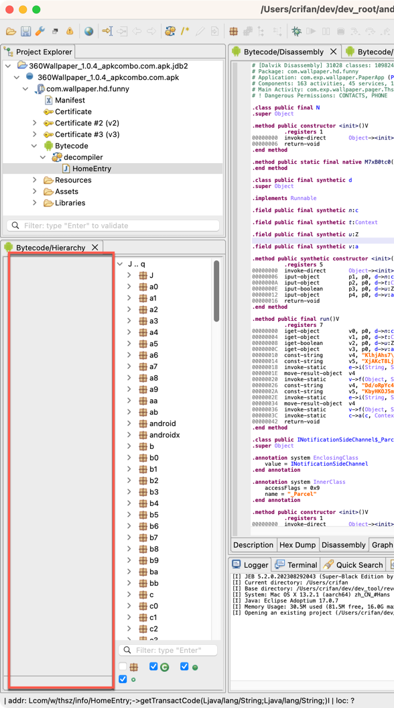

# JEB常见问题

## Bytecode/Hierarchy窗口出现多余的一列

* 问题：重新打开加载之前的jdb2项目后，往往会看到：`Bytecode/Hierarchy`窗口有多余的一列
  * 
* 解决办法：关闭后重新打开`Bytecode/Hierarchy`窗口
* 具体步骤：
  * 概述：`Project Explorer`中apk展开列表中的`Bytecode`右键选`Open View`
  * 详解：[页面显示心得](../usage_summary/ui_config/README.md) 中的`关闭Bytecode/Hierarchy窗口后，如何恢复显示`
