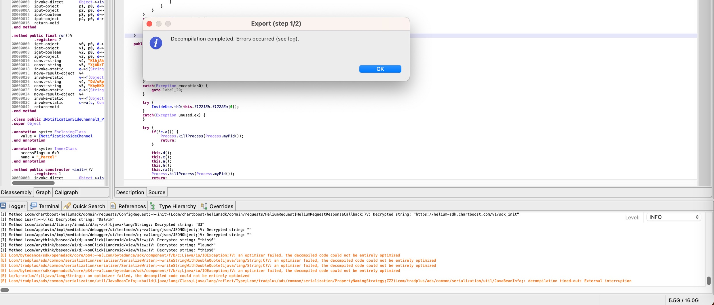
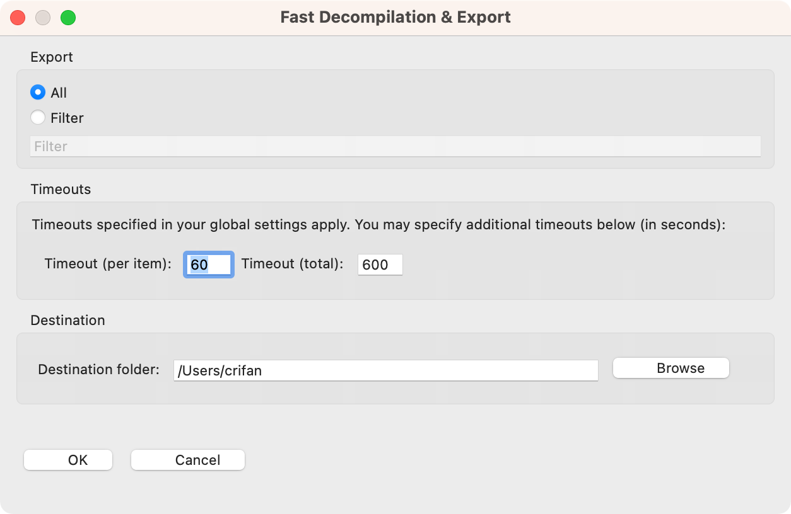
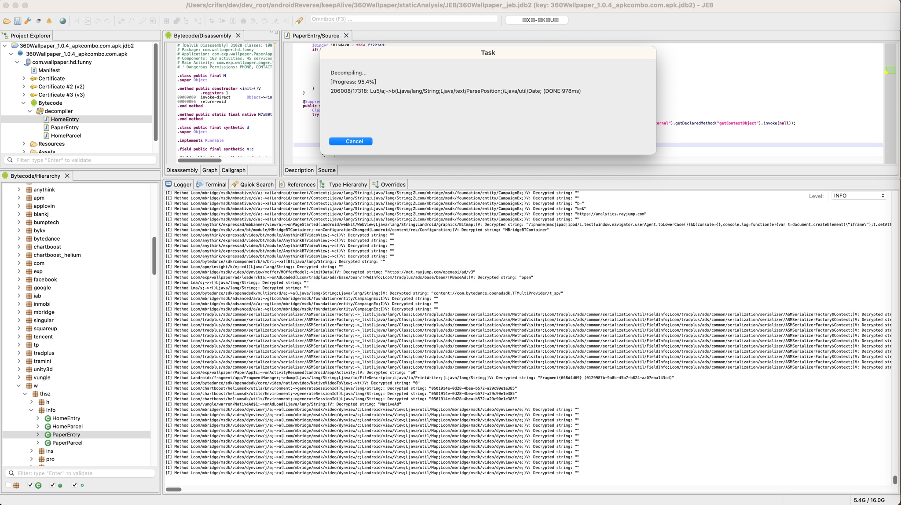
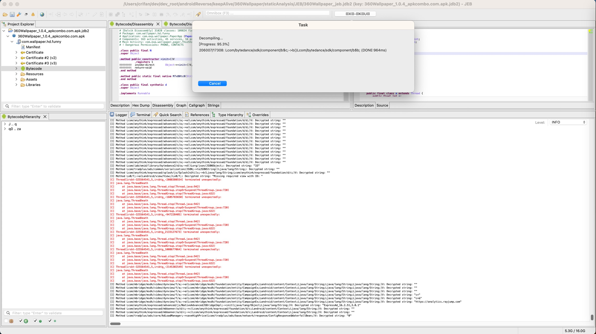
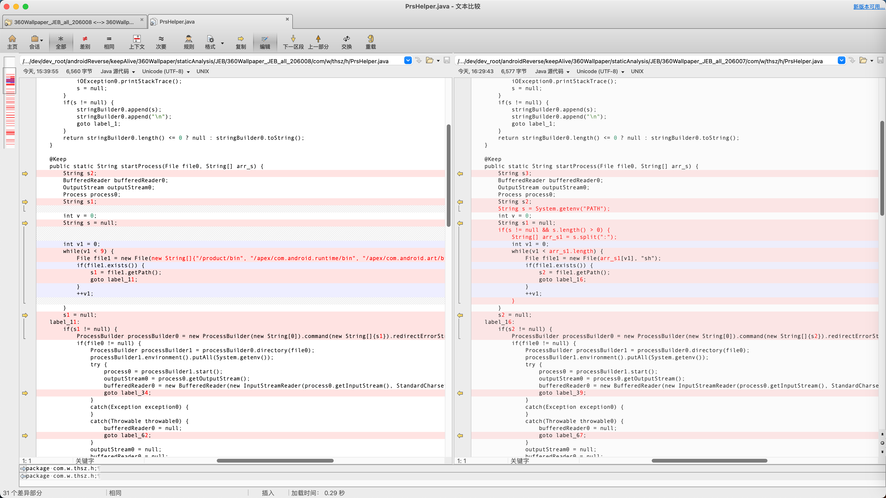
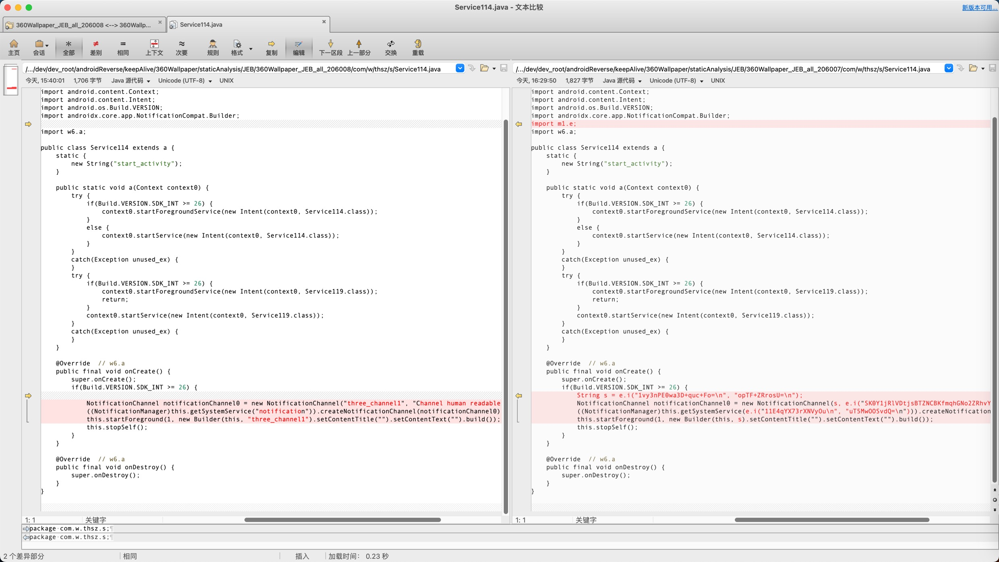
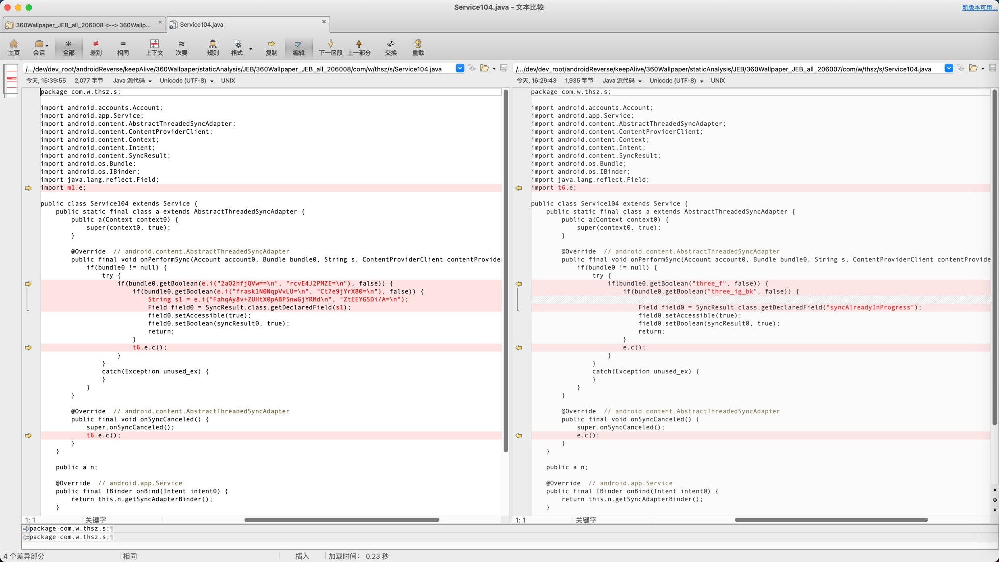

# 反编译java代码问题

此处整理，JEB反编译java代码方面的问题：

## 批量反编译全部java代码

### 用默认超时设置会导致最后由于超时而被中断停止

* 问题：在[批量反编译全部代码](../../jeb_static_analysis/decompile_apk/decompile_to_java/batch_all.md)最后报错
  * 弹框：`Decompilation completed. Errors occurred` + Logger日志中显示错误原因： `decompilation timed-out: External interruption`
    * 
* 原因：JEB默认的超时设置太短了：
  * 
    * Timeout per item: `60`=1分钟
    * Timeout total: `600`=10分钟
  * 而此处要反编译的内容较多，耗时比较久，超过了10分钟的总时长超时限制，因此中断退出
* 解决办法：增大超时方面的设置
  * 比如
    * 
      * Timeouts: 
        * Timeout per item: `600`=10分钟
        * Timeout total: `60000`=100分钟

### 最后会卡死和多次的反编译输出结果不稳定

在[批量反编译全部代码](../../jeb_static_analysis/decompile_apk/decompile_to_java/batch_all.md)期间，遇到一些问题：

* 反编译到最后进度95%左右时，会卡死
  * 先后遇到多次，都是一样的问题：最后到`95.3`、`95.4`左右的进度后，就卡死了
    * 
    * 
  * 如果要继续等待：估计永远没有结果
    * 之前等待了足够长时间：几十分钟，仍然没有任何进度更新
  * 最后只能去：点击`Cancel`去取消
  * 之后即可正常继续去保存和导出已反编译出的所有java代码
* 多次（2次）反编译的结果，内容不一致=输出结果不稳定
  * 专门测试了2次
    * 一次最终反编译总数是：`206008`
    * 另一次最终反编译总数是：`206007`
  * 发现前后反编译出的java代码，不一致
    * 总体上反编译的内容的效果，算是各有优劣
      * 有时候是`206007`的版本更好点
        * 举例
          * 此处还原了`System.getenv("PATH")`的逻辑，而不是输出所有返回的结果的列表
            * 
              * `206007`版本相关代码
                ```java
                  String s = System.getenv("PATH");
                  int v = 0;
                  String s1 = null;
                  if(s != null && s.length() > 0) {
                      String[] arr_s1 = s.split(":");
                      int v1 = 0;
                      while(v1 < arr_s1.length) {
                          File file1 = new File(arr_s1[v1], "sh");
                          if(file1.exists()) {
                              s2 = file1.getPath();
                              goto label_16;
                          }
                          ++v1;
                      }
                  }
                ```
              * `206008`版本相关代码
                ```java
                  String s1;
                  int v = 0;
                  String s = null;
                  int v1 = 0;
                  while(v1 < 9) {
                      File file1 = new File(new String[]{"/product/bin", "/apex/com.android.runtime/bin", "/apex/com.android.art/bin", "/system_ext/bin", "/system/bin", "/system/xbin", "/odm/bin", "/vendor/bin", "/vendor/xbin"}[v1], "sh");
                      if(file1.exists()) {
                          s1 = file1.getPath();
                          goto label_11;
                      }
                      ++v1;
                  }
                ```
      * （个别）加密字符串被自动解密还原成原始字符串了
        * 注：不论哪个版本，其实绝大多数加密字符串，都是已经被解密还原的。此处只是个别字符串是否被解密还原，有区别
        * `206008`版本更好点：`206008`自动解密还原了，而`206007`没有
          * 
        * `206007`版本更好点：`206007`自动解密还原了，而`206008`没有
          * 

然后只能根据自己的实际情况，决定保留哪份结果。

或者实在不行，再多弄几次代码的全部反编译，对比找到相对最优的结果。

总之对于反编译结果最后卡死，以及每次输出结果不一致不稳定，还是有点麻烦的。
