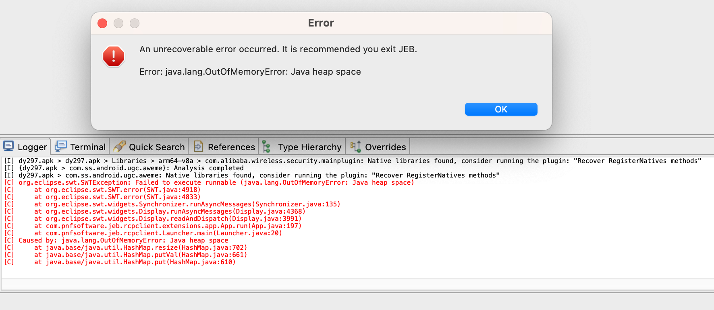

# apk解析问题

JEB导入apk解析过程期间，也会遇到一些常见问题。

## Error: java.lang.OutOfMemoryError: Java heap space

* 现象：JEB导入apk后，开始解析，最后报错

```bash
[I] {dy297.apk > com.ss.android.ugc.aweme}: Analysis completed
[I] dy297.apk > com.ss.android.ugc.aweme: Native libraries found, consider running the plugin: "Recover RegisterNatives methods"
[C] org.eclipse.swt.SWTException: Failed to execute runnable (java.lang.OutOfMemoryError: Java heap space)
[C] 	at org.eclipse.swt.SWT.error(SWT.java:4918)
[C] 	at org.eclipse.swt.SWT.error(SWT.java:4833)
[C] 	at org.eclipse.swt.widgets.Synchronizer.runAsyncMessages(Synchronizer.java:135)
[C] 	at org.eclipse.swt.widgets.Display.runAsyncMessages(Display.java:4368)
[C] 	at org.eclipse.swt.widgets.Display.readAndDispatch(Display.java:3991)
[C] 	at com.pnfsoftware.jeb.rcpclient.extensions.app.App.run(App.java:197)
[C] 	at com.pnfsoftware.jeb.rcpclient.Launcher.main(Launcher.java:20)
[C] Caused by: java.lang.OutOfMemoryError: Java heap space
[C] 	at java.base/java.util.HashMap.resize(HashMap.java:702)
[C] 	at java.base/java.util.HashMap.putVal(HashMap.java:661)
[C] 	at java.base/java.util.HashMap.put(HashMap.java:610)
```



* 原因：Java的JVM的内存不够用了，超过最大允许的内存，而崩溃
* 解决办法：增加最大内存
* 具体步骤

给此处的JEB的脚本

JEB/JEB-5.2.0.202308292043_by_CXV/jeb_macos.sh

改为：

```bash
# Manual override for JVM options: run the script with -j, uncomment the following line and adjust if necessary
# JVMOPT="-Xss4M -Xmx8G"
JVMOPT="-Xss4M -Xmx48G"
```

意思是：

* `-Xss4M`
  * 设置 Java 线程堆栈大小：`4MB`
* `-Xmx48G`
  * 设置最大 Java 堆大小：`48GB`

即：给Java的JVM虚拟机的最大内存是48G（此处是Mac M2 Max，总内存是64GB）

如此确保有足够的内存可用，避免了内存不够用的报错
