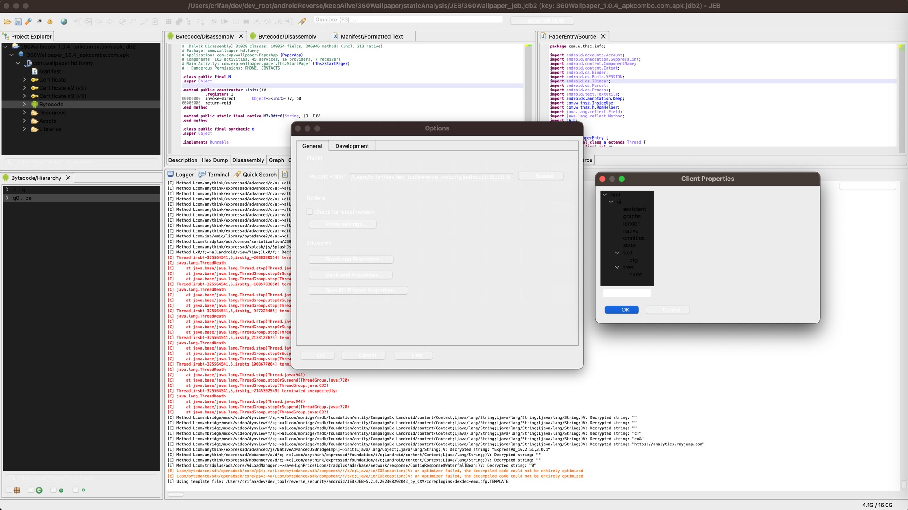

# 页面显示问题

## 白天和夜晚模式切换后，界面显示不正常

* 问题：Mac中，从白天进入夜晚（或者反过来，从夜晚过了一夜到了第二天白天），白天和夜晚模式切换后，所有页面全都显示异常：
  * Project Explorer、Bytecode/Hierarchy，Preferences设置页面等窗口，都无法看清内容
    * 
* 原因：JEB的bug
* 解决办法：
  * 办法1：重启JEB
  * 办法2：[多主题显示效果](../../function_ui/multiple_themes.md)中的`切换主题`
    * 通过切换主题，即可消除显示异常的部分，起到刷新显示的效果
* 结果：即可正常显示内容
  * 
