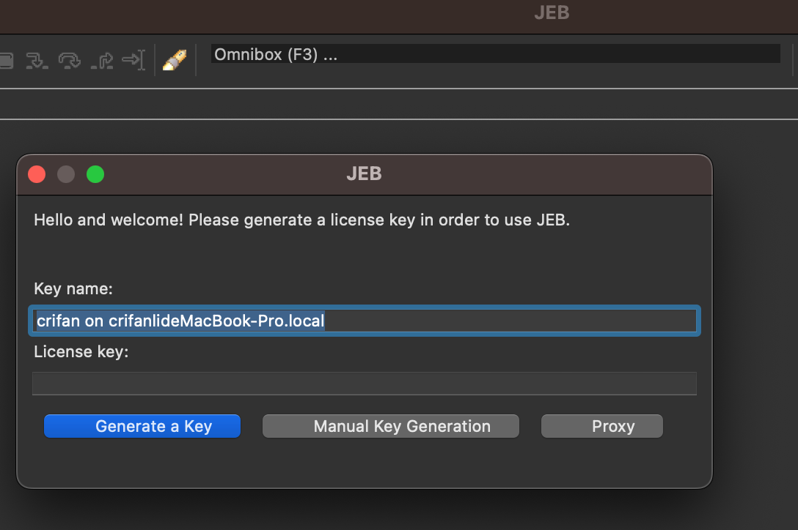

# 下载运行JEB

## 官网免费版

* JEB免费版
  * 有2个
    * 社区版=JEB Community Edition
      * 注：不支持Android（的arm），仅支持（32位和64位的）x86
      * 下载页面：[JEB Community Edition - JEB Decompiler by PNF Software](https://www.pnfsoftware.com/jeb/community-edition)
    * 演示版=JEB Demo
      * 注：功能有很多限制，主要用于试用
      * 下载页面：[Download a trial version of JEB - JEB Decompiler by PNF Software](https://www.pnfsoftware.com/jeb/demo)

## JEB破解版

> #### danger::仅供学习研究技术用
> 此处提供破解版，仅供学习研究技术用，请勿用于其他非法和商业用途。请支持正版。
> 
> 如有侵权，请联系笔者删除

* 下载JEB
  * 下载地址：[JEB-5.2.0.202308292043_by_CXV.7z ~ pixeldrain](https://pixeldrain.com/u/iPz6HCP2)
    * 下载得到 460MB+ 的：`JEB-5.2.0.202308292043_by_CXV.7z`
      * 
* 运行JEB
  * 解压后，运行对应脚本
    * Mac的：`jeb_macos.sh`
      * 
    * Win的：`jeb_wincon.bat`
    * Linux的：`jeb_linux.sh`
  * 运行方式
    * 如果双击脚本，无法自动运行的话
      * 比如
        * 调用文本编辑器打开sh脚本
        * 报其他错误：`A session ended very soon after starting. Check that the command in profile "Default" is correct.`
          * 
    * 则去加上可执行权限
      * Mac中
        ```bash
        chmod +x jeb_macos.sh
        ```
    * 再放到终端terminal/shell中去运行
      * 常见终端
        * Mac：`iTerm2`/`shell`
          ```bash
          ./jeb_macos.sh
          ```
            * 附录：此处终端启动的log日志
              ```bash
              ➜  JEB-5.2.0.202308292043_by_CXV ./jeb_macos.sh
              [I] JEB 5.2.0.202308292043 (Super-Black Edition by CXV) is starting...
              [I] Current directory: /Users/crifan/dev/dev_tool/reverse_security/android/JEB/JEB-5.2.0.202308292043_by_CXV
              [I] Base directory: /Users/crifan/dev/dev_tool/reverse_security/android/JEB/JEB-5.2.0.202308292043_by_CXV
              [I] System: Mac OS X 13.2.1 (aarch64) zh_CN_#Hans
              [I] Java: Eclipse Adoptium 17.0.7
              [I] Memory Usage: 31.4M used (80.6M free, 16.0G max)
              ```
        * Linux：自带shell
        * Win：`cmd.exe`
    * 首次启动时
      * 需要去生成key，再点击继续，即可
        * 点击`Generate a Key` -> `Continue`
          * 
  * 主界面
    * 
