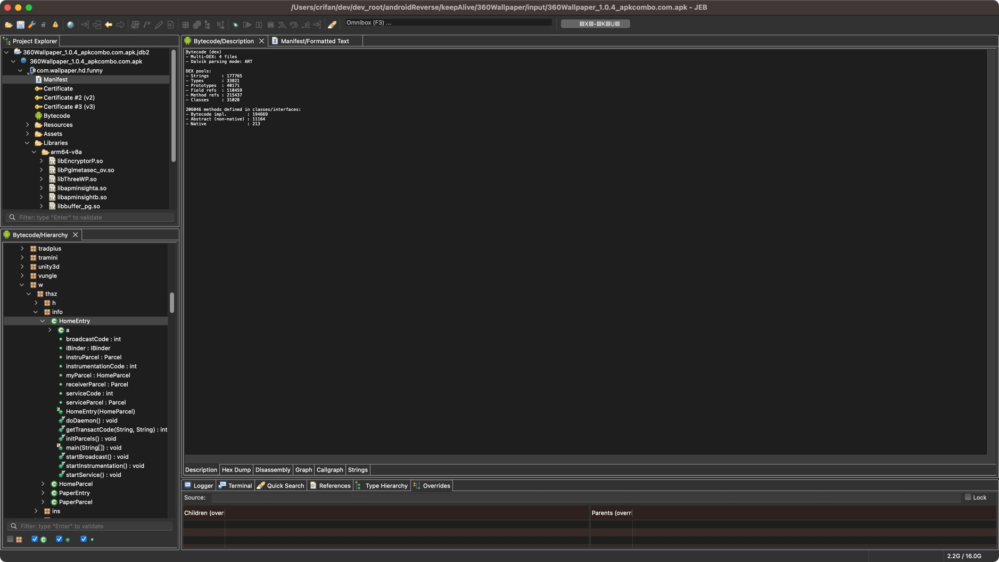
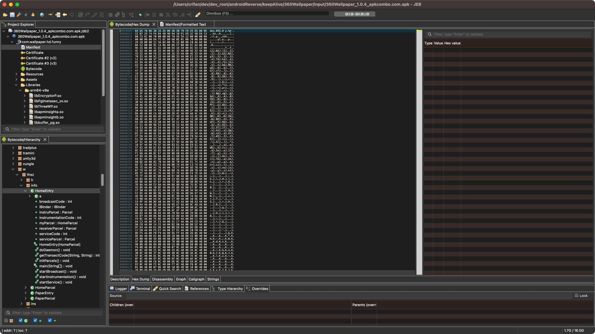
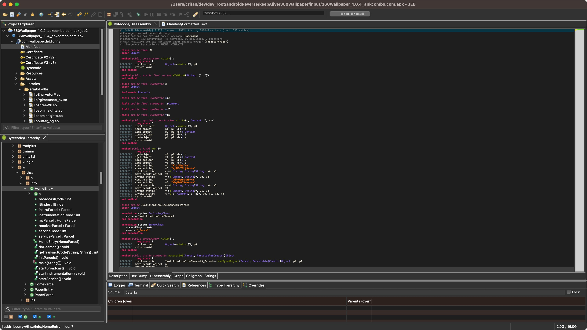
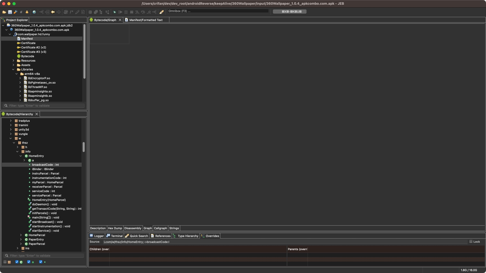
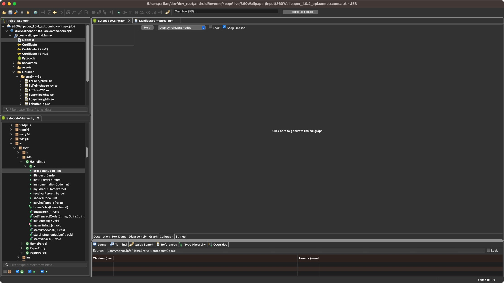
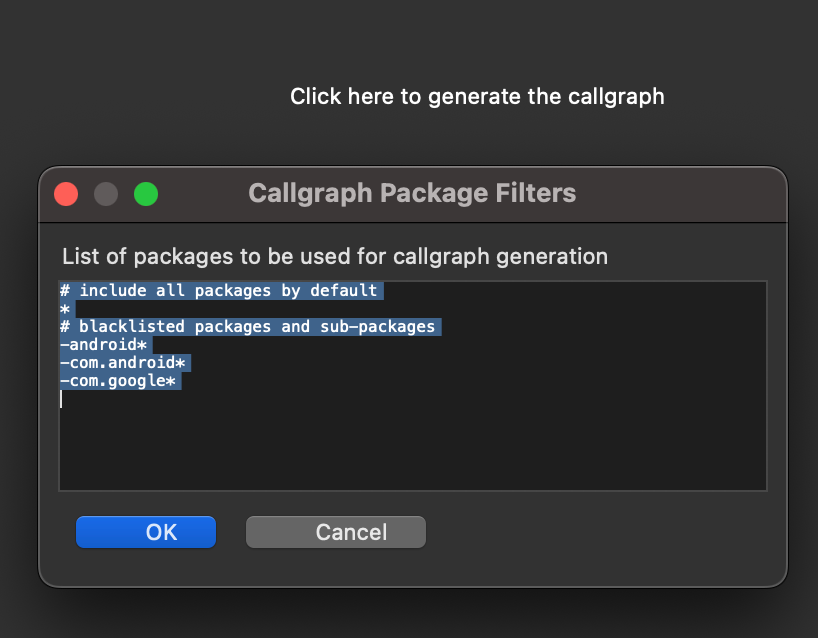
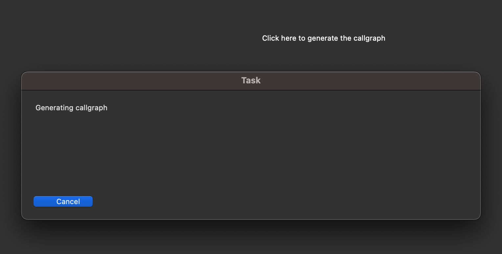
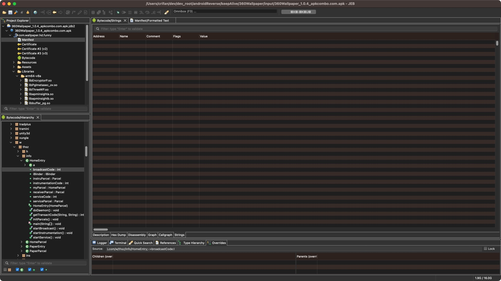

# Bytecode的多个显示模式

* Description=描述
  * 
* Hex Dump
  * 
* Disassembly
  * 
* Graph
  * 
* Callgraph
  * 
    * 注：点击后，会卡死
      * 但是后来某次点击，暂时没卡死，出现弹框
        * 
      * 弹框提示：开始生成callgraph
        * 
      * 但是耗时太久，就放弃了
        * TODO：抽空再试试效果
* Strings
  * 


顺带贴出Bytecode的`Disassembly`的部分代码：

```java
# [Dalvik Disassembly] 31028 classes: 109824 fields, 206046 methods (incl. 213 native)
# Package: com.wallpaper.hd.funny
# Application: com.exp.wallpaper.PaperApp (PaperApp)
# Components: 163 activities, 45 services, 16 providers, 7 receivers
# Main Activity: com.exp.wallpaper.pager.ThszStartPager (ThszStartPager)
# ! Dangerous Permissions: PHONE, CONTACTS
.class public final N
.super Object
.method public constructor <init>()V
.registers 1
00000000 invoke-direct Object-><init>()V, p0
00000006 return-void
.end method
.method public static final native M7xB0tc0(String, [J, I)V
.end method
.class public final synthetic d
.super Object
.implements Runnable
.field public final synthetic n:c
.field public final synthetic t:Context
.field public final synthetic u:Z
.field public final synthetic v:a
.method public synthetic constructor <init>(c, Context, Z, a)V
.registers 5
00000000 invoke-direct Object-><init>()V, p0
00000006 iput-object p1, p0, d->n:c
0000000A iput-object p2, p0, d->t:Context
0000000E iput-boolean p3, p0, d->u:Z
00000012 iput-object p4, p0, d->v:a
00000016 return-void
.end method
.method public final run()V
.registers 7
00000000 iget-object v0, p0, d->n:c
00000004 iget-object v1, p0, d->t:Context
00000008 iget-boolean v2, p0, d->u:Z
0000000C iget-object v3, p0, d->v:a
00000010 const-string v4, "KlhjAhs7\n"
00000014 const-string v5, "XjAKcT8Lj9w=\n"
00000018 invoke-static e->i(String, String)String, v4, v5
0000001E move-result-object v4
00000020 invoke-static v->f(Object, String)V, v0, v4
00000026 const-string v4, "Dd/oRpYc4p8=\n"
0000002A const-string v5, "KbyHKOJ5mus=\n"
0000002E invoke-static e->i(String, String)String, v4, v5
00000034 move-result-object v4
00000036 invoke-static v->f(Object, String)V, v1, v4
0000003C invoke-static c->a(c, Context, Z, a)V, v0, v1, v2, v3
00000042 return-void
.end method
.class public INotificationSideChannel$_Parcel
.super Object
.annotation system EnclosingClass
value = INotificationSideChannel
.end annotation
.annotation system InnerClass
accessFlags = 0x9
name = "_Parcel"
.end annotation
.method public constructor <init>()V
.registers 1
00000000 invoke-direct Object-><init>()V, p0
00000006 return-void
.end method
.method public static synthetic access$000(Parcel, Parcelable$Creator)Object
.registers 2
00000000 invoke-static INotificationSideChannel$_Parcel->readTypedObject(Parcel, Parcelable$Creator)Object, p0, p1

...
...
...

.class public abstract interface INotificationSideChannel
.super Object
.implements IInterface
.annotation system MemberClasses
value = {
INotificationSideChannel$_Parcel,
INotificationSideChannel$Stub,
INotificationSideChannel$Default
}
.end annotation
.field public static final DESCRIPTOR:String
.method static constructor <clinit>()V
.registers 3
00000000 const-string v0, "android$support$v4$app$INotificationSideChannel"
00000004 const/16 v1, 36
00000008 const/16 v2, 46
0000000C invoke-virtual String->replace(C, C)String, v0, v1, v2
00000012 move-result-object v0
00000014 sput-object v0, INotificationSideChannel->DESCRIPTOR:String
00000018 return-void
.end method
.method public abstract cancel(String, I, String)V
.annotation system Throws
value = {
RemoteException
}
.end annotation
.end method
.method public abstract cancelAll(String)V
.annotation system Throws
value = {
RemoteException
}
.end annotation
.end method
.method public abstract notify(String, I, String, Notification)V
.annotation system Throws
value = {
RemoteException
}
.end annotation
.end method
.class MediaBrowserCompat$CallbackHandler
.super Handler
.annotation system EnclosingClass
value = MediaBrowserCompat
.end annotation
.annotation system InnerClass
accessFlags = 0x9
name = "CallbackHandler"
.end annotation
.field private final mCallbackImplRef:WeakReference
.annotation system Signature
value = {
"Ljava/lang/ref/WeakReference<",
"Landroid/support/v4/media/MediaBrowserCompat$MediaBrowserServiceCallbackImpl;",
">;"
}
.end annotation
.end field
```
