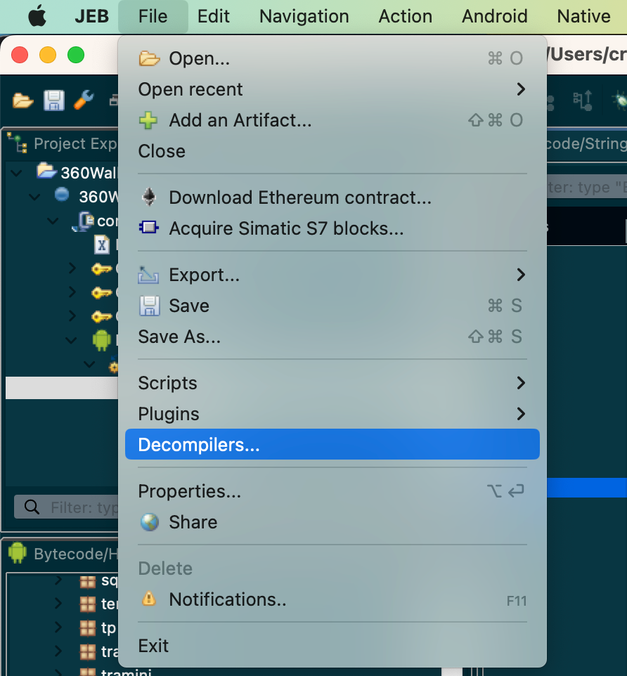
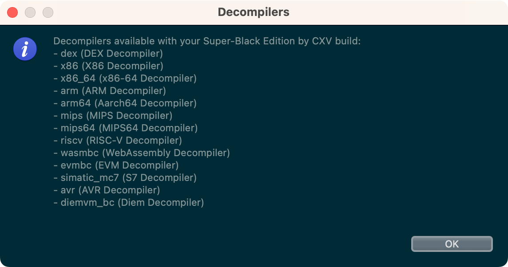

# 反编译器

* `JEB`->`File`->`Decompilers`
  * 
    * 
* -> 可以看到当前JEB版本，所支持的各种架构的反编译器
  * dex (`DEX` Decompiler)
  * x86 (`X86` Decompiler)
  * x86_64 (`X86-64` Decompiler)
  * arm (`ARM` Decompiler)
  * arm64 (`Aarch64` Decompiler)
  * mips (`MIPS` Decompiler)
  * riscv (`RISC-V` Decompiler)
  * wasmbc (`WebAssembly` Decompiler)
  * evmbc (`EVM` Decompiler)
  * simatic_mc7 (`S7` Decompiler)
  * avr (`AVR` Decompiler)
  * diemvm_bc (`Diem` Decompiler)
