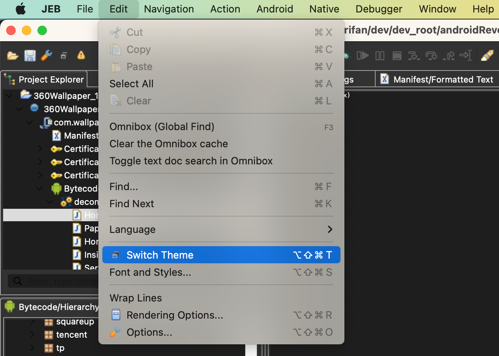
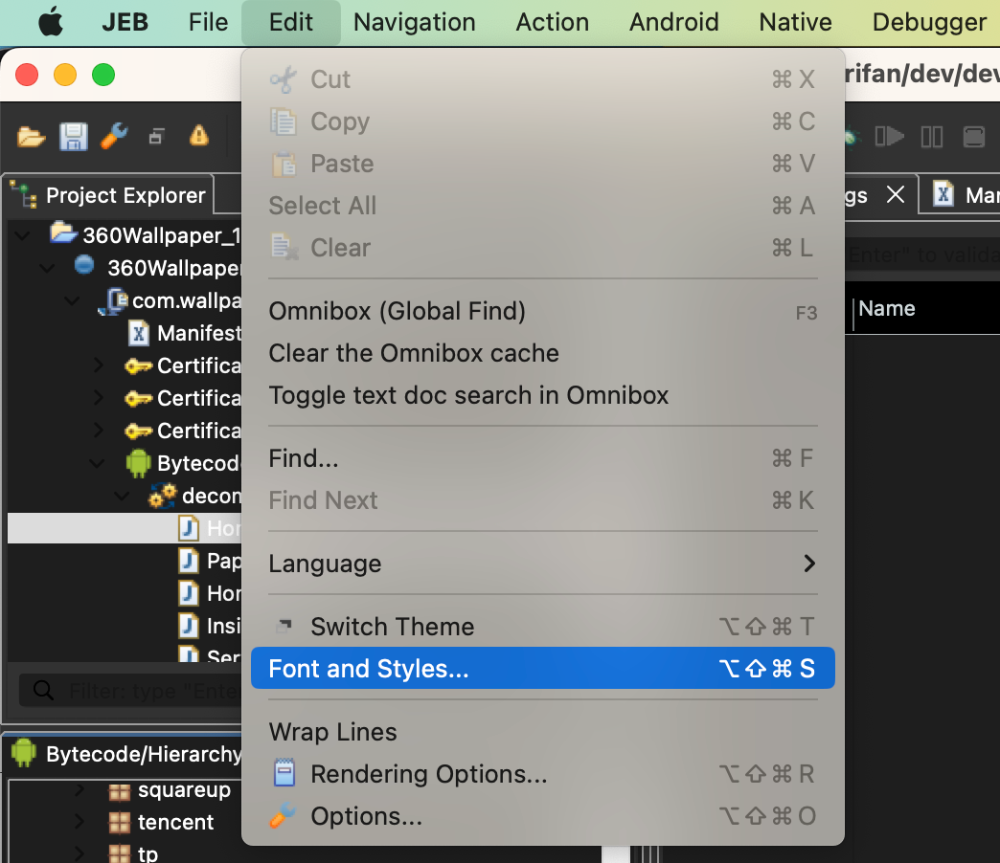
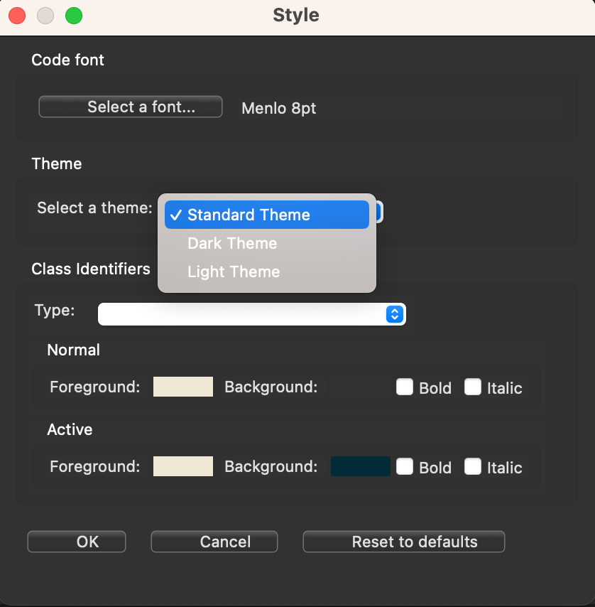
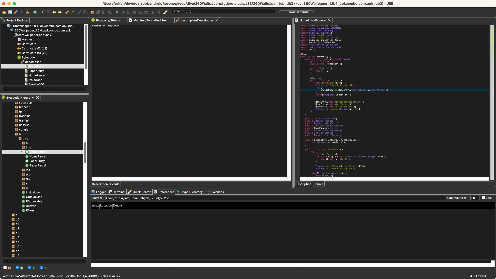
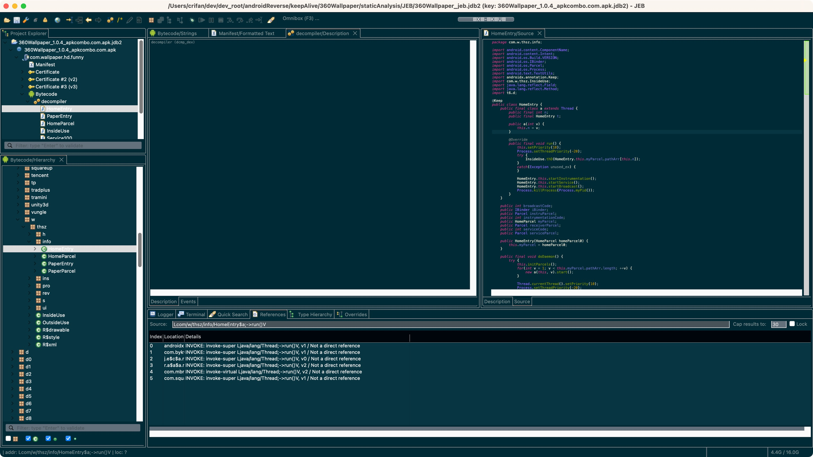
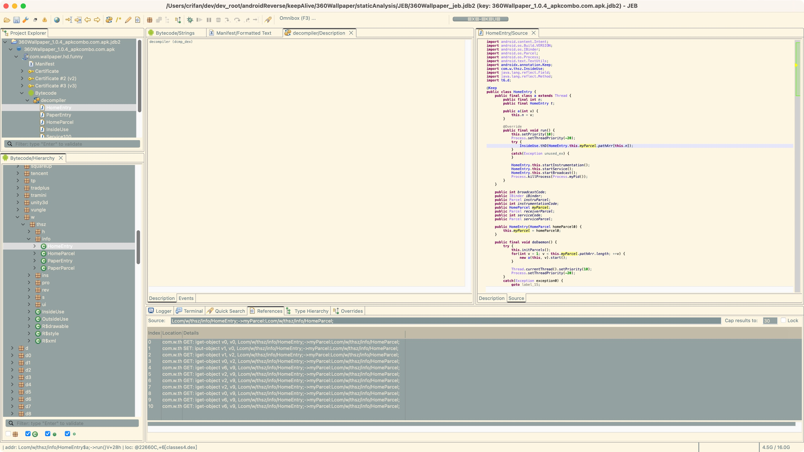

# JEB多主题显示效果

JEB中显示方面，支持多个主题：

* 如何切换主题？
  * `JEB`->`Edit`-`Switch Theme`
    * 
* 不同主题的名称
  * 最开始以为：JEB中无法查看当前主题的名称
    * 只能看到主题效果
  * 后记：后来找到了主题设置，才看到主题名称（吐槽：JEB的设置很分散，很混乱）
    * `JEB`->`Edit`->`Font and styles`
      * 
    * 然后可以看到主题名称，可以切换主题
      * 
        * Standard Theme == 黑色
        * Dark Theme == 淡蓝色
        * Light Theme == 淡黄色
* 多个不同主题的显示效果
  * Standard Theme == 黑色
    * 
  * Dark Theme == 淡蓝色
    * 
  * Light Theme == 淡黄色
    * 
