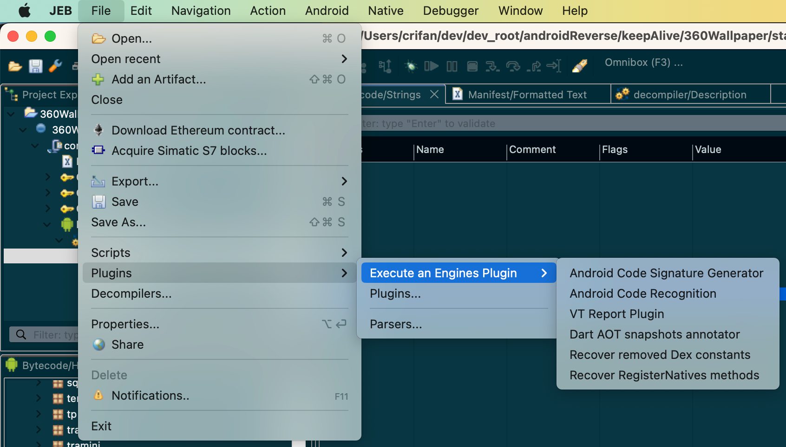
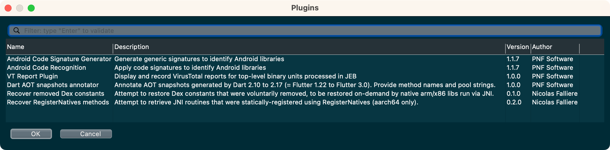

# 插件

JEB支持插件机制。内置就有一些插件：

* `JEB`->`File`->`Plugins`->`Execute and Engins Plugin`
  * 
    * 可以看到内置引擎插件
      * Android Code Signature Generator
      * Android Code Recogintion
      * VT Report Plugin
      * Dart AOT snapthots annotator
      * Recover removed Dex constants
      * Recover RegisterNatives methods
  * 如果点击：`JEB`->`File`->`Plugins`->`Plugins`，会出现弹框，显示当前插件列表，显示插件详情：名称、功能描述、版本、作者等
    * 
