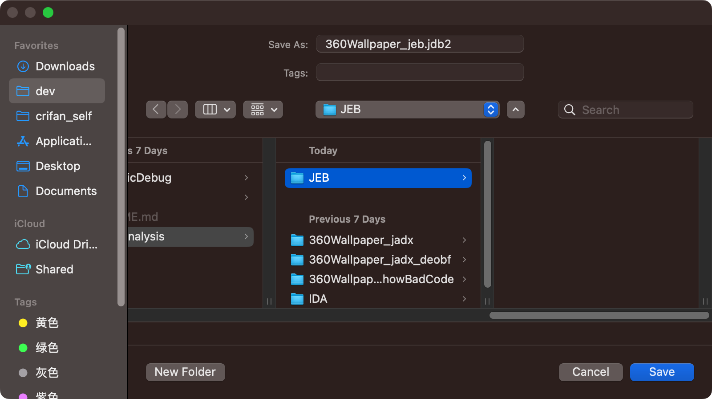
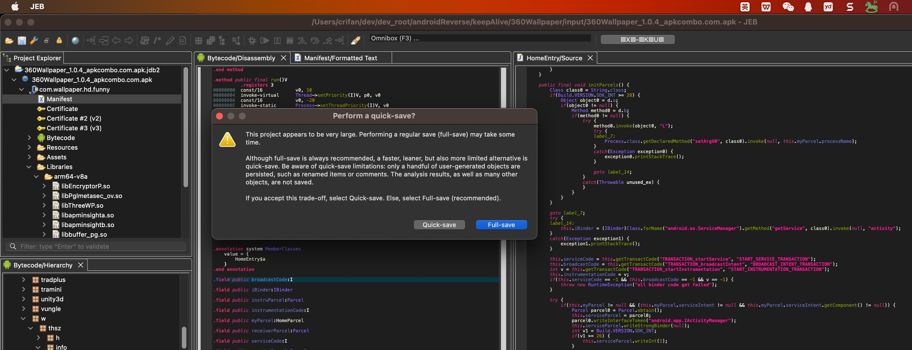

# 保存项目文件jdb2

当需要时，可以去保存当前项目：

`JEB`->`File`->`Save As`，会提示`Save the current projec to JDB2 database`

给文件起个名字：

首次保存时，会提示：

项目看起来很大，保存时选用哪种模式：

* regular save=普通保存=full-save=全部保存
  * 缺点：耗时
  * 优点：所有改动都会保存
* quick save=快速保存=轻量级保存
  * 缺点：只保存一些用户生成的对象，比如重命名、注释等
    * 但是反编译等解析结果不保存
      * 注：这些解析结果，可以每次打开时，重新解析
  * 优点：速度快

此处为了确保改动都保存，选择了：`full-save`=`全部保存`

然后会有弹框显示保存进度：

此处保存耗时大概几十秒，总体上还算可以接受。

保存出的`.jdb2`文件：

