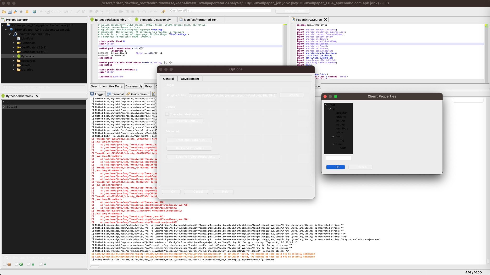
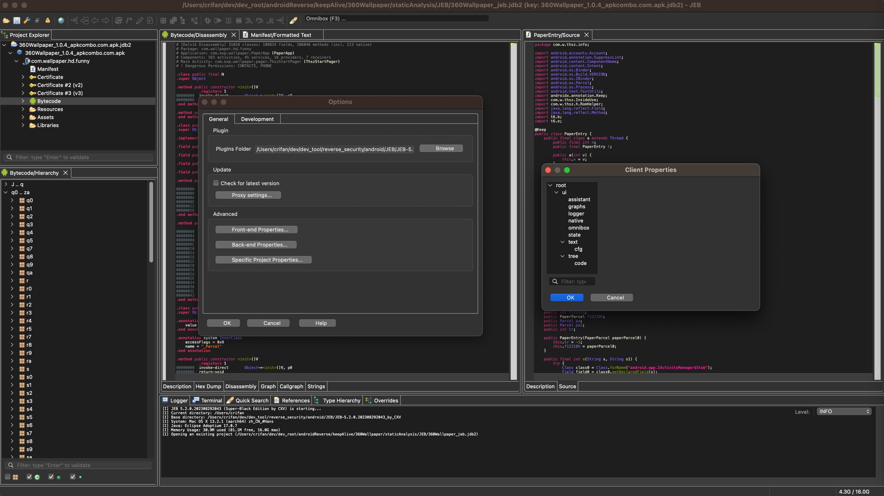

# 页面显示问题

## 夜晚模式显示时，界面不正常

* 问题：从白天进入页面后，Mac所有显示界面自动变成夜晚模式，此时JEB的界面，就显示异常了：
  * Project Explorer、Bytecode/Hierarchy，Preferences设置页面等窗口，都无法看清内容
    * 
* 原因：JEB的bug
* 解决办法：重启JEB
  * 即可正常显示内容
    * 
    * 
