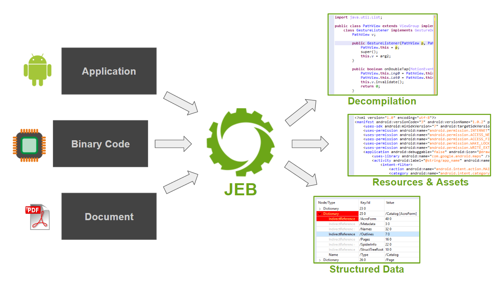

# JEB概览

* `JEB`
  * 是什么：安卓逆向工具
    * 一款专业逆向工具，主要用于安卓逆向
  * 一句话描述
    * Android Decompiler + Android Debuggers
  * 主要用途
    * [安卓逆向](https://book.crifan.org/books/android_reverse_dev/website/)领域的
      * [静态分析](https://book.crifan.org/books/android_re_static_analysis/website/)中的：反编译`apk`/`dex`
        * 最大特点：反编译效果，比[jadx](https://book.crifan.org/books/android_re_decompile_jadx/website/)还好
      * [动态调试](https://book.crifan.org/books/android_re_dynamic_debug/website/)中的：调试安卓app
  * 主页
    * [JEB Decompiler by PNF Software](https://www.pnfsoftware.com/)
      * [JEB Android Decompiler - JEB Decompiler by PNF Software](https://www.pnfsoftware.com/jeb/android)
        * 
  * 功能
    * 静态分析
      * Android Decompiler
        * 反编译decompile安卓app
          * 支持反混淆（的代码的重构）
          * 重构资源和反混淆XML文件
        * 核心流程
          * 
        * 模块化
          * 安卓模块=Android modules
            * The Android modules for JEB provide static and dynamic analysis capabilities to analyze Android applications, goodware or badware, small or large
          * 原生代码分析模块=native code analysis modules
            * The native code analysis modules provide advanced code analyzers and decompilers for Intel x86, ARM, MIPS, RISC-V processors, as well as WebAssembly modules and Ethereum smart contracts
          * PDF模块=PDF module
            * Our PDF module for JEB can be used to manually or automatically reverse engineer and assess PDF documents
      * 安全审计恶意安卓app
    * 动态调试
      * Android Debuggers
        * 调试debug安卓app
          * 调试Dalvik代码和native原生代码（Intel和ARM）
    * 支持（调用API实现）脚本自动化处理（安卓逆向）
