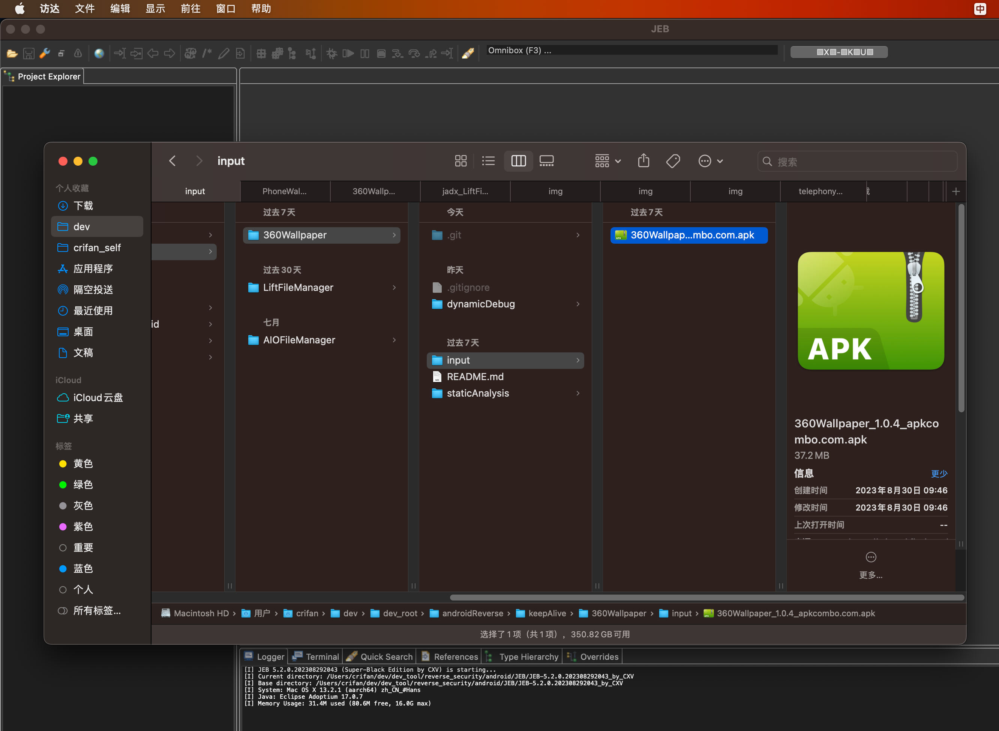
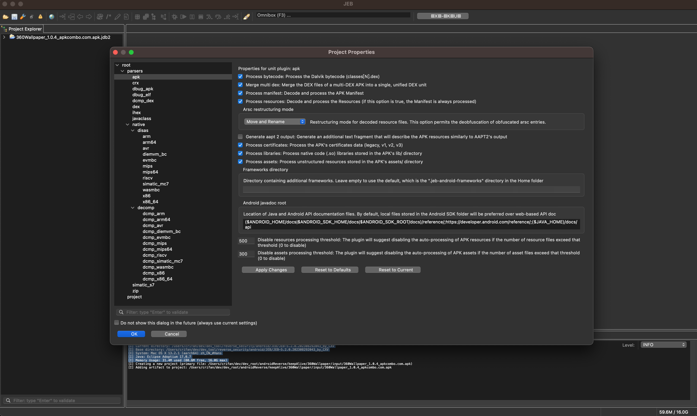
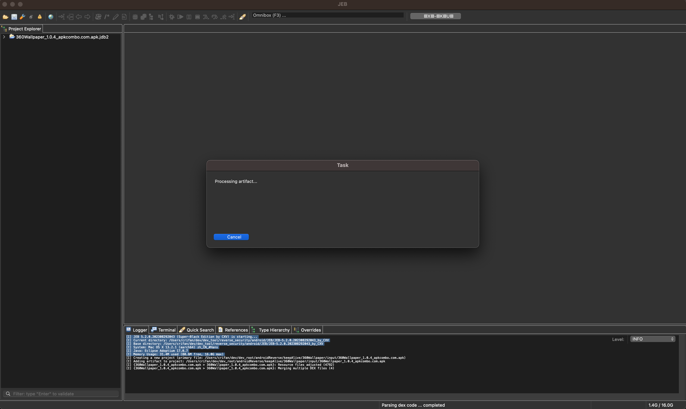
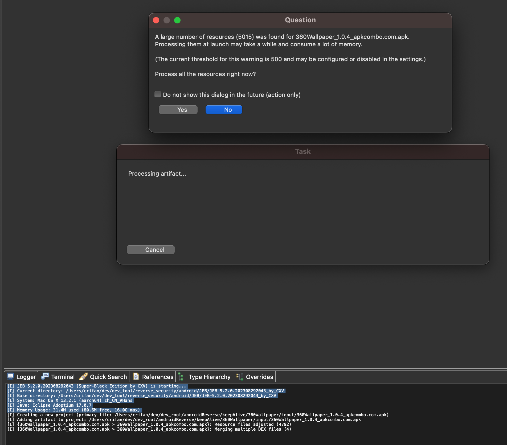
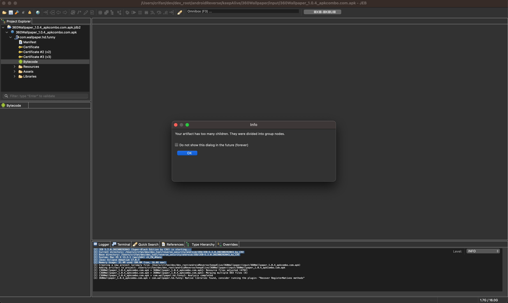
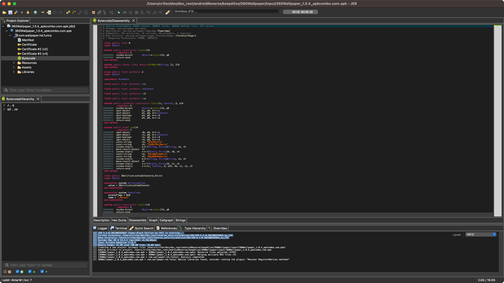

# 用JEB反编译安卓apk

直接把apk拖动到JEB中，即可自动开始反编译。

## 举例

### 用JEB反编译360Wallpaper的apk

直接把`360Wallpaper`的`apk`文件，直接拖动到JEB中：

会弹框`Project Property`：

此处可以自动识别输入文件类型是：`apk`，所以自动选择了`apk`的配置，保持默认配置即可，点击：`OK`，继续反编译：

然后会弹框`Task`，开始处理：

此处由于类太多，所以会提示，问是否继续，点击`Yes`：

后续，由于反编译出来的类太多以及类有很多子类和属性children，所以会提示会按组分类显示，点击`OK`：

然后就可以看到，反编译后的主界面了：

如此，反编译就结束了。
