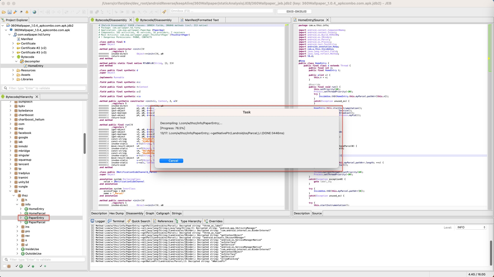

# 反编译java代码

## java代码支持动态提示详情

反编译后的java代码窗口中，鼠标移动到某个内容上，比如类，函数等，此时可以：显示出对应内容的详情

举例：鼠标移动到某函数上，可以显示出函数的详情：

## 双击Bytecode中对应的类可以自动反编译

对于Bytecode窗口中，对于某个类（`com.w.thsz.info.PaperEntry`，双击后，等价于`右键`->`Decompile`

会弹框提示开始反编译：

反编译完成后，此处右上角显示出反编译后的java源码：

