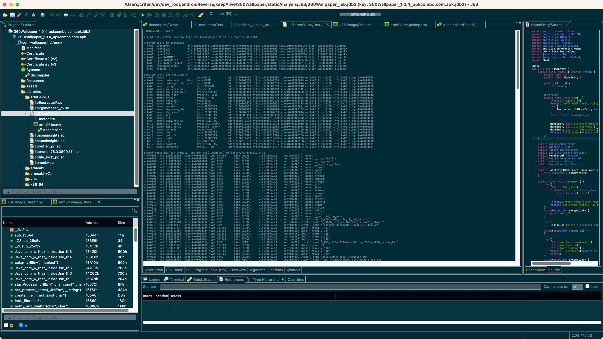
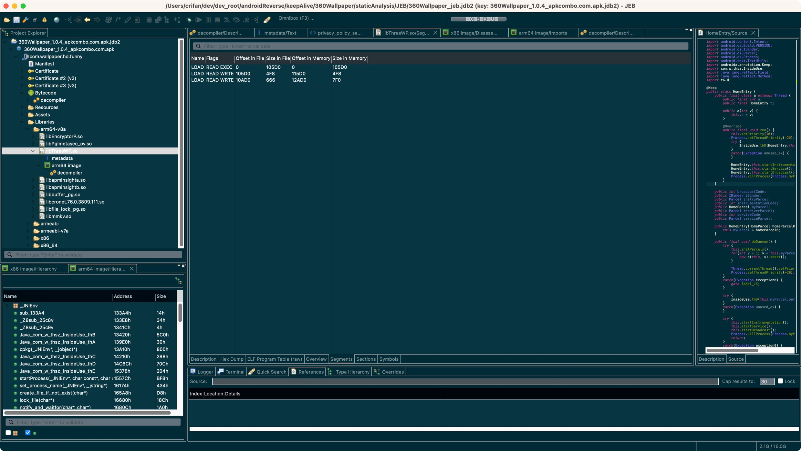

# 解析so库文件

继续查看，JEB反编译apk后，对于其中的so库文件的解析。

展开到：`apk`->`app包名`->`Libraries`->此处的某个so库文件：`libThreeWP.so`


然后可以分别查看解析效果：

* （ELF格式的）so库文件
  * Overview
    * 
  * Description
    * 
  * Hex Dump
    * 
  * ELF Program Table (raw)
    * 
  * Segements
    * 
  * Sections
    * 
  * Symbols
    * 
* so下面还有2个子项
  * metadata
    * 
  * arm64 image
    * 
    * 其也有各个子页面
      * Description
        * 
          ```bash
          arm64 image (arm64)

          Info:
          - Processor: ARM64
          - Compiler (detected): Android NDK compiler
          - Methods: 129 (internal: 106)
          ```
      * Hex Dump
        * 
      * Disassembly
        * 
      * Graph
        * 
      * Callgraph
        * 注：容易导致卡死
          * TODO：有空再去试试
      * Stings
        * 
      * Types
        * 
      * Imports
        * 
      * Exports
        * 
      * Referenced Methods
        * 
    * 其下也有子项
      * decompiler
        * 
