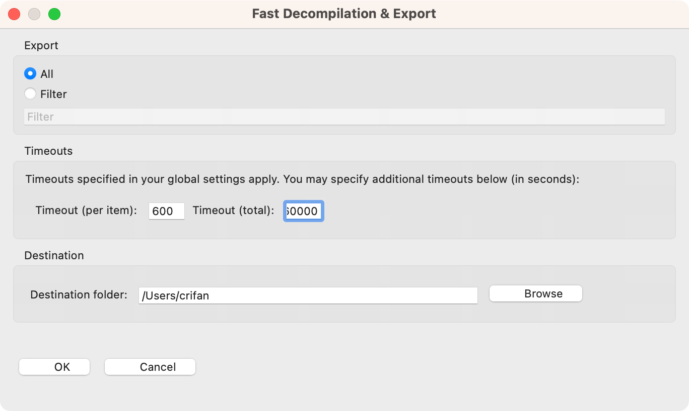
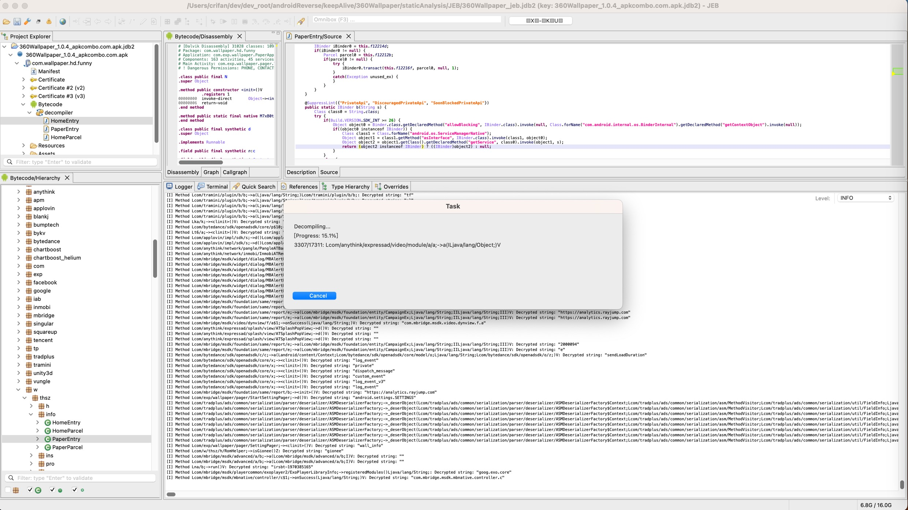
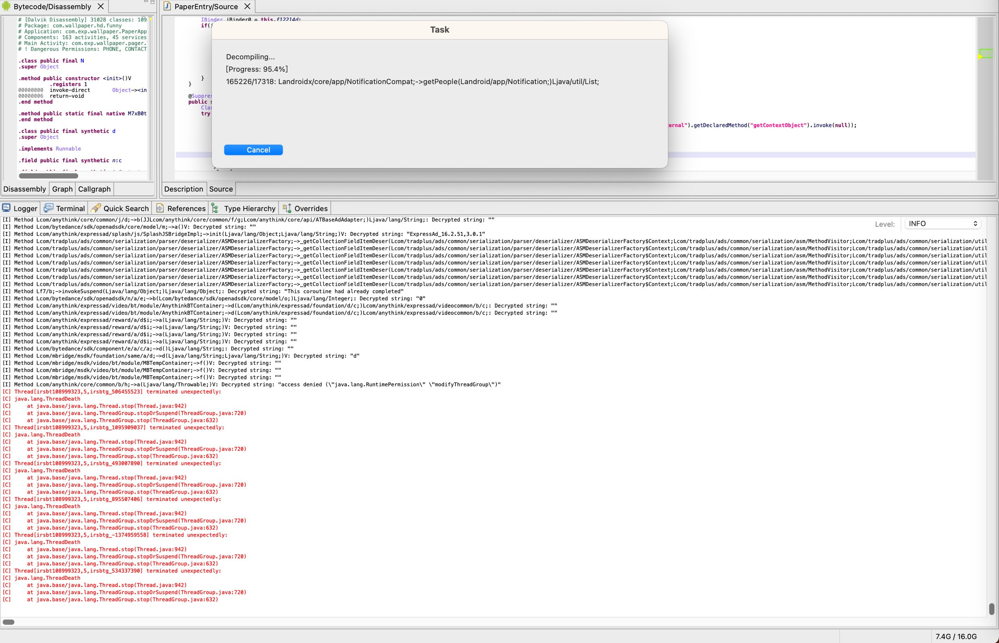
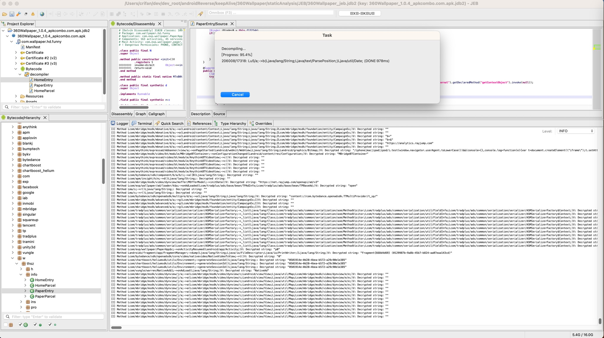
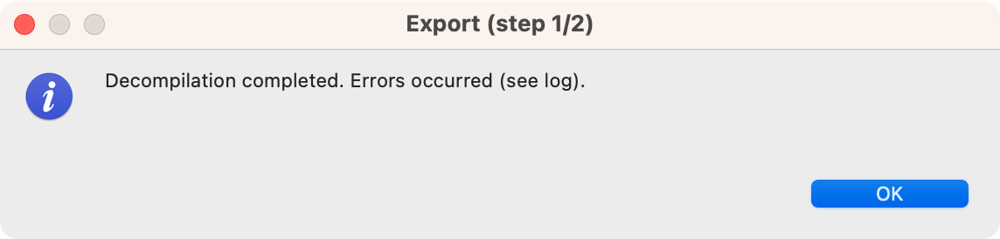
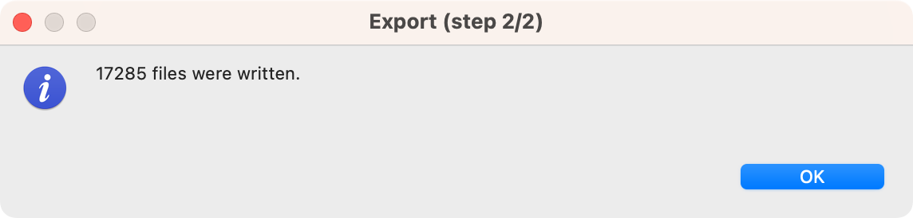
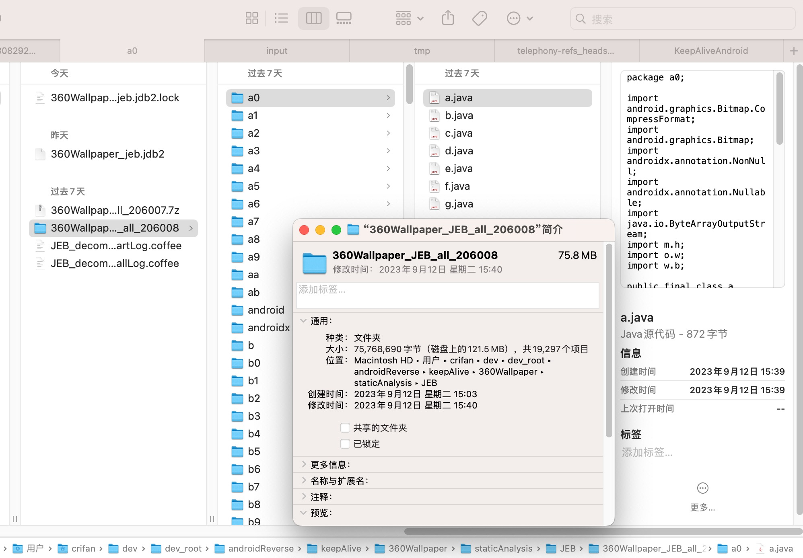

# 全部反编译

* 需求：JEB中想要（批量）反编译出全部的Java代码
* 步骤：`JEB`->`File`->`Export`->`Decompilation`

会弹框`Fast Decompilation & Export`：

此处参数设置：

* `Export`: `All`
  * 说明：（反编译后）导出所有Java代码
* `Timeouts`: 反编译的超时设置
  * `Timeout per item`: `600`=10分钟
  * `Timeout total`: `60000`=100分钟
* `Destination`：选择保存目标文件夹

然后就是开始反编译，显示进度的弹框了：

期间底部的Logger会输出对应的日志

偶尔也会看到反编译期间会报错：

正常情况下，应该看到反编译进度`100%`

但是此处实际上先后2次反编译都出现：反编译进度到`95%`左右：

然后就：卡死了，等待很多分钟后，进度也没变化

此时只能：点击`Cancel`取消

然后可以继续，会弹框提示：

* Export Step (1/2)
  * Decomplilation completed. Errors occurred (see log)
    * 

点击`OK`继续，显示：

* Export Step (2/2)
  * xxx file were written
    * 

最后确认，的确导出了17285个文件：

如此，反编译就算完成了。
