# 反编译效果对比：JEB vs jadx

## 概述

* `JEB` vs `jadx`反编译效果对比概述
  * `JEB`比`jadx`反编译效果还好
    * 可以自动把加密混淆的乱码类字符串，自动反混淆解密出原始正常字符串
      * jadx：无法自动反混淆字符串
        * 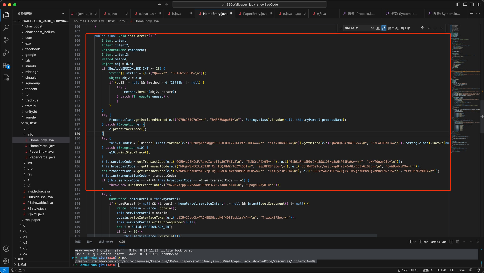
          ```java
              public final void initParcels() {
          ...
                      Process.class.getDeclaredMethod(e.i("97HxJBfO7nI=\n", "hNSFZWWpuEI=\n"), String.class).invoke(null, this.myParcel.processName);
                  } catch (Exception e) {
                      e.printStackTrace();
                  }
                  try {
                      this.iBinder = (IBinder) Class.forName(e.i("GzUxplaokQgVKHuHXLODTxk+GLVXoJJDCA==\n", "eltV1DnB9SY=\n")).getMethod(e.i("jNe0Q4U47DWI1w==\n", "67LAEOBKmlw=\n"), String.class).invoke(null, e.i("hQG5PXN9gEE=\n", "5GLNVAUU9Dg=\n"));
                  } catch (Exception e10) {
                      e10.printStackTrace();
                  }
                  this.serviceCode = getTransactCode(e.i("GOED4uC5HIcF/AzzwIw+oTjgJ97FkTy2\n", "TLNCrLP4X9M=\n"), e.i("6ibSaFhtSRDrJNp5SW1OB/g8wHtPZlMa9w==\n", "uXKTOgwyGlU=\n"));
                  this.broadcastCode = getTransactCode(e.i("hDg9W0xEC3iZJTJKfXcnTbQJHWZrTCZYtQQI\n", "0Gp8FR8FSCw=\n"), e.i("qbfO4YGsTom/usjukapBjrSx0+GLvE6Zv6zO7g==\n", "6+WBoMXvD9o=\n"));
                  int transactCode = getTransactCode(e.i("wnWPhO6qs6bfaICVzp+RgOJuoLnJmYWf80m6q8mCn5w=\n", "lifOyr3r8PI=\n"), e.i("RGOVY5WGeT9EY4ZkjJx+JVZjnX6PhmQjVnmHcIKNeT5Z\n", "FzfUMcHZMHE=\n"));
          ```
      * JEB：可以自动反混淆字符串 = 还原出原始字符串
        * 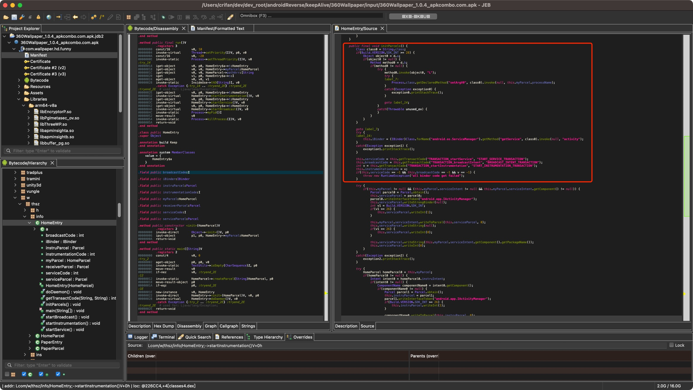
          ```java
              public final void initParcels() {
          ...
                                      Process.class.getDeclaredMethod("setArgV0", class0).invoke(null, this.myParcel.processName);
          ...
                  }
          ...
                      this.iBinder = (IBinder)Class.forName("android.os.ServiceManager").getMethod("getService", class0).invoke(null, "activity");
          ...
                  this.serviceCode = this.getTransactCode("TRANSACTION_startService", "START_SERVICE_TRANSACTION");
                  this.broadcastCode = this.getTransactCode("TRANSACTION_broadcastIntent", "BROADCAST_INTENT_TRANSACTION");
                  int v = this.getTransactCode("TRANSACTION_startInstrumentation", "START_INSTRUMENTATION_TRANSACTION");
          ```

## 举例详解：`360Wallpaper`反编译效果对比

### 类：`com.w.thsz.info.HomeEntry`反编译效果对比

#### JEB

* 截图
  * 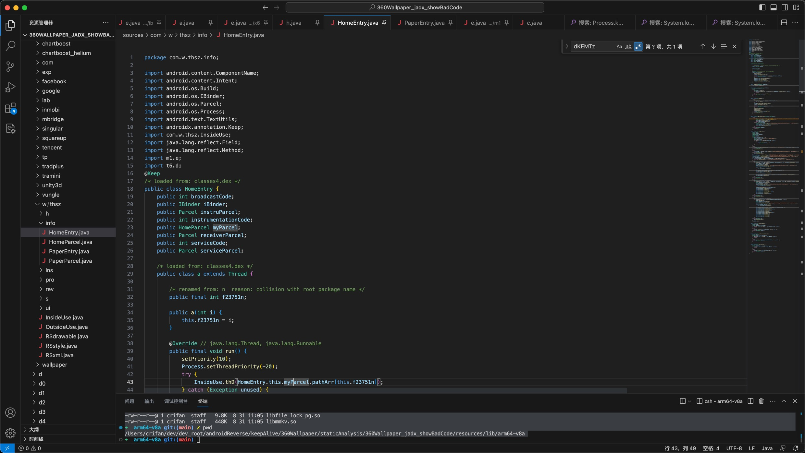
  * 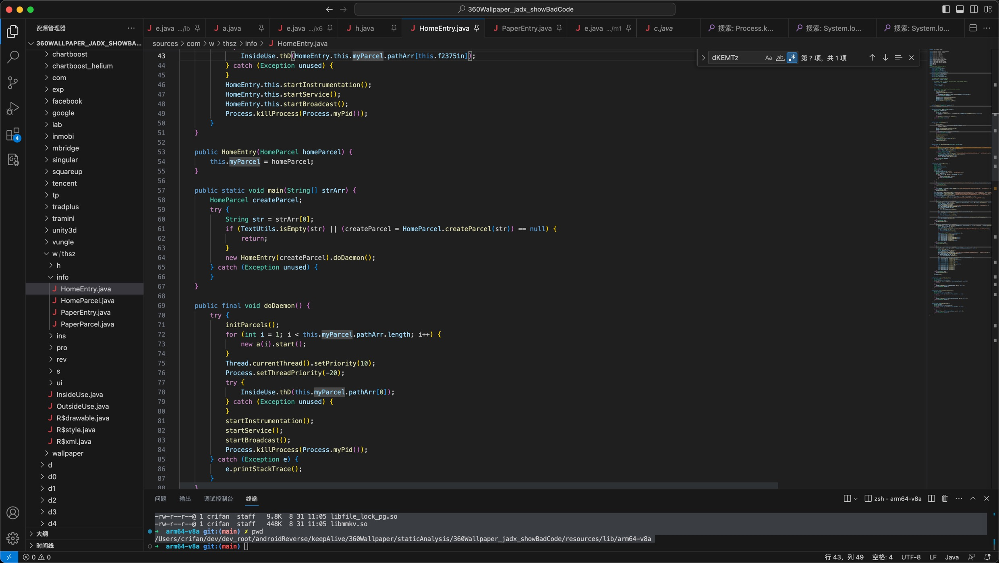
  * 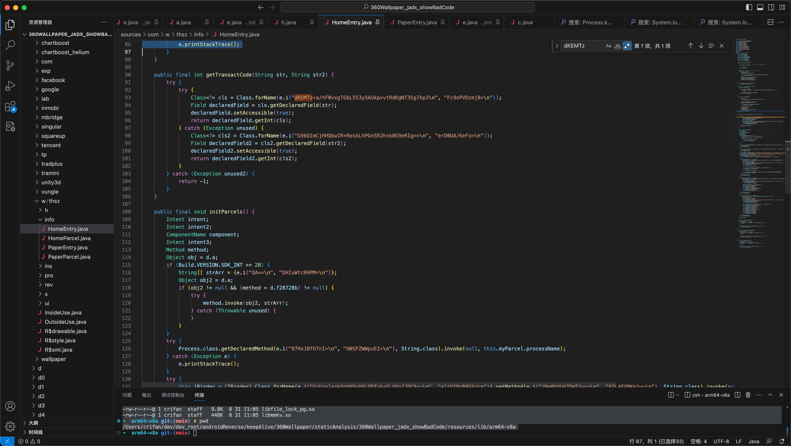
  * 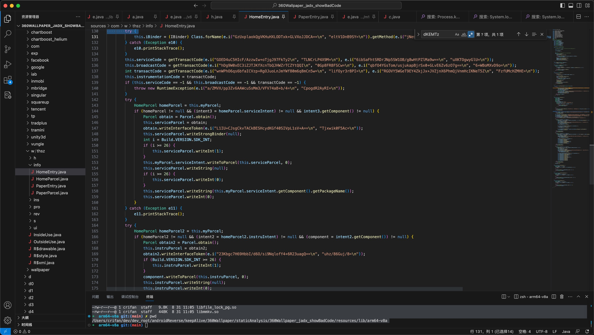
  * 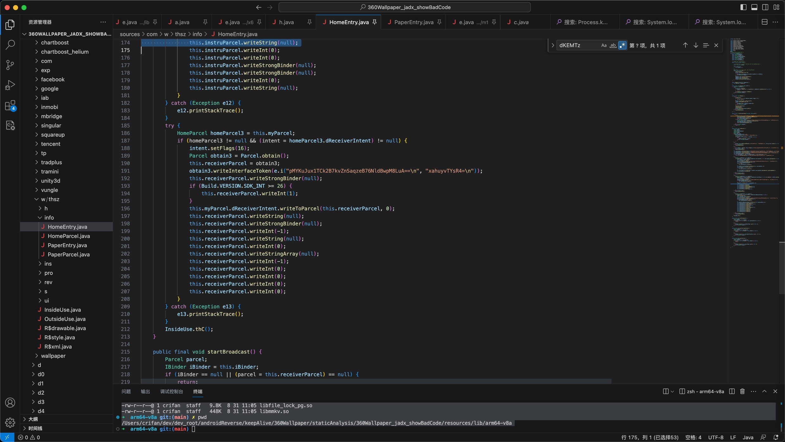
  * 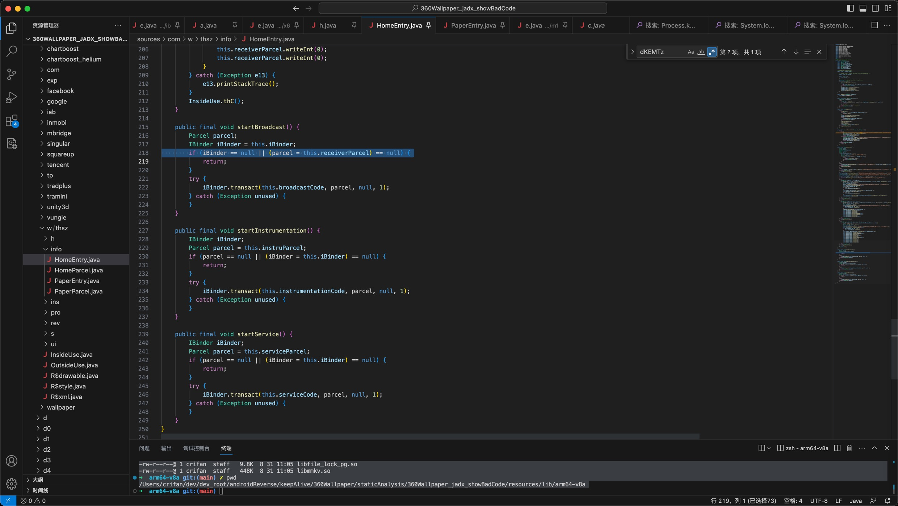
* 代码

```java
package com.w.thsz.info;

import android.content.ComponentName;
import android.content.Intent;
import android.os.Build;
import android.os.IBinder;
import android.os.Parcel;
import android.os.Process;
import android.text.TextUtils;
import androidx.annotation.Keep;
import com.w.thsz.InsideUse;
import java.lang.reflect.Field;
import java.lang.reflect.Method;
import m1.e;
import t6.d;
@Keep
/* loaded from: classes4.dex */
public class HomeEntry {
    public int broadcastCode;
    public IBinder iBinder;
    public Parcel instruParcel;
    public int instrumentationCode;
    public HomeParcel myParcel;
    public Parcel receiverParcel;
    public int serviceCode;
    public Parcel serviceParcel;

    /* loaded from: classes4.dex */
    public class a extends Thread {

        /* renamed from: n  reason: collision with root package name */
        public final int f23751n;

        public a(int i) {
            this.f23751n = i;
        }

        @Override // java.lang.Thread, java.lang.Runnable
        public final void run() {
            setPriority(10);
            Process.setThreadPriority(-20);
            try {
                InsideUse.thD(HomeEntry.this.myParcel.pathArr[this.f23751n]);
            } catch (Exception unused) {
            }
            HomeEntry.this.startInstrumentation();
            HomeEntry.this.startService();
            HomeEntry.this.startBroadcast();
            Process.killProcess(Process.myPid());
        }
    }

    public HomeEntry(HomeParcel homeParcel) {
        this.myParcel = homeParcel;
    }

    public static void main(String[] strArr) {
        HomeParcel createParcel;
        try {
            String str = strArr[0];
            if (TextUtils.isEmpty(str) || (createParcel = HomeParcel.createParcel(str)) == null) {
                return;
            }
            new HomeEntry(createParcel).doDaemon();
        } catch (Exception unused) {
        }
    }

    public final void doDaemon() {
        try {
            initParcels();
            for (int i = 1; i < this.myParcel.pathArr.length; i++) {
                new a(i).start();
            }
            Thread.currentThread().setPriority(10);
            Process.setThreadPriority(-20);
            try {
                InsideUse.thD(this.myParcel.pathArr[0]);
            } catch (Exception unused) {
            }
            startInstrumentation();
            startService();
            startBroadcast();
            Process.killProcess(Process.myPid());
        } catch (Exception e) {
            e.printStackTrace();
        }
    }

    public final int getTransactCode(String str, String str2) {
        try {
            try {
                Class<?> cls = Class.forName(e.i("dKEMTz+a/hF0vxgTGbL5S3y5AUkpvvtRdKgNT3Sg7kp3\n", "Fc9oPVDzmj8=\n"));
                Field declaredField = cls.getDeclaredField(str);
                declaredField.setAccessible(true);
                return declaredField.getInt(cls);
            } catch (Exception unused) {
                Class<?> cls2 = Class.forName(e.i("G96QImCjHHQbwIR+RosbLhPGnSR2hxk0G9eRIg==\n", "erD0UA/KeFo=\n"));
                Field declaredField2 = cls2.getDeclaredField(str2);
                declaredField2.setAccessible(true);
                return declaredField2.getInt(cls2);
            }
        } catch (Exception unused2) {
            return -1;
        }
    }

    public final void initParcels() {
        Intent intent;
        Intent intent2;
        ComponentName component;
        Intent intent3;
        Method method;
        Object obj = d.a;
        if (Build.VERSION.SDK_INT >= 28) {
            String[] strArr = {e.i("QA==\n", "DHIuWtcRHPM=\n")};
            Object obj2 = d.a;
            if (obj2 != null && (method = d.f28728b) != null) {
                try {
                    method.invoke(obj2, strArr);
                } catch (Throwable unused) {
                }
            }
        }
        try {
            Process.class.getDeclaredMethod(e.i("97HxJBfO7nI=\n", "hNSFZWWpuEI=\n"), String.class).invoke(null, this.myParcel.processName);
        } catch (Exception e) {
            e.printStackTrace();
        }
        try {
            this.iBinder = (IBinder) Class.forName(e.i("GzUxplaokQgVKHuHXLODTxk+GLVXoJJDCA==\n", "eltV1DnB9SY=\n")).getMethod(e.i("jNe0Q4U47DWI1w==\n", "67LAEOBKmlw=\n"), String.class).invoke(null, e.i("hQG5PXN9gEE=\n", "5GLNVAUU9Dg=\n"));
        } catch (Exception e10) {
            e10.printStackTrace();
        }
        this.serviceCode = getTransactCode(e.i("GOED4uC5HIcF/AzzwIw+oTjgJ97FkTy2\n", "TLNCrLP4X9M=\n"), e.i("6ibSaFhtSRDrJNp5SW1OB/g8wHtPZlMa9w==\n", "uXKTOgwyGlU=\n"));
        this.broadcastCode = getTransactCode(e.i("hDg9W0xEC3iZJTJKfXcnTbQJHWZrTCZYtQQI\n", "0Gp8FR8FSCw=\n"), e.i("qbfO4YGsTom/usjukapBjrSx0+GLvE6Zv6zO7g==\n", "6+WBoMXvD9o=\n"));
        int transactCode = getTransactCode(e.i("wnWPhO6qs6bfaICVzp+RgOJuoLnJmYWf80m6q8mCn5w=\n", "lifOyr3r8PI=\n"), e.i("RGOVY5WGeT9EY4ZkjJx+JVZjnX6PhmQjVnmHcIKNeT5Z\n", "FzfUMcHZMHE=\n"));
        this.instrumentationCode = transactCode;
        if (this.serviceCode == -1 && this.broadcastCode == -1 && transactCode == -1) {
            throw new RuntimeException(e.i("a/ZMVX/pp3Zv6AAWcuSsMm3/VFV74aB+b/4=\n", "CpogdR2AyRI=\n"));
        }
        try {
            HomeParcel homeParcel = this.myParcel;
            if (homeParcel != null && (intent3 = homeParcel.serviceIntent) != null && intent3.getComponent() != null) {
                Parcel obtain = Parcel.obtain();
                this.serviceParcel = obtain;
                obtain.writeInterfaceToken(e.i("L1IU+CJsgCkvTACkBESHcydKGf40SIVpL1sV+A==\n", "Tjxwik0F5Ac=\n"));
                this.serviceParcel.writeStrongBinder(null);
                int i = Build.VERSION.SDK_INT;
                if (i >= 26) {
                    this.serviceParcel.writeInt(1);
                }
                this.myParcel.serviceIntent.writeToParcel(this.serviceParcel, 0);
                this.serviceParcel.writeString(null);
                if (i >= 26) {
                    this.serviceParcel.writeInt(0);
                }
                this.serviceParcel.writeString(this.myParcel.serviceIntent.getComponent().getPackageName());
                this.serviceParcel.writeInt(0);
            }
        } catch (Exception e11) {
            e11.printStackTrace();
        }
        try {
            HomeParcel homeParcel2 = this.myParcel;
            if (homeParcel2 != null && (intent2 = homeParcel2.instruIntent) != null && (component = intent2.getComponent()) != null) {
                Parcel obtain2 = Parcel.obtain();
                this.instruParcel = obtain2;
                obtain2.writeInterfaceToken(e.i("23Kbgc7H69HbbI/d6O/si9NqlofY4+6R23uagQ==\n", "uhz/86Guj/8=\n"));
                if (Build.VERSION.SDK_INT >= 26) {
                    this.instruParcel.writeInt(1);
                }
                component.writeToParcel(this.instruParcel, 0);
                this.instruParcel.writeString(null);
                this.instruParcel.writeInt(0);
                this.instruParcel.writeInt(0);
                this.instruParcel.writeStrongBinder(null);
                this.instruParcel.writeStrongBinder(null);
                this.instruParcel.writeInt(0);
                this.instruParcel.writeString(null);
            }
        } catch (Exception e12) {
            e12.printStackTrace();
        }
        try {
            HomeParcel homeParcel3 = this.myParcel;
            if (homeParcel3 != null && (intent = homeParcel3.dReceiverIntent) != null) {
                intent.setFlags(16);
                Parcel obtain3 = Parcel.obtain();
                this.receiverParcel = obtain3;
                obtain3.writeInterfaceToken(e.i("pMYKuJux1TCk2B7kvZnSaqzeB76NldBwpM8LuA==\n", "xahuyvTYsR4=\n"));
                this.receiverParcel.writeStrongBinder(null);
                if (Build.VERSION.SDK_INT >= 26) {
                    this.receiverParcel.writeInt(1);
                }
                this.myParcel.dReceiverIntent.writeToParcel(this.receiverParcel, 0);
                this.receiverParcel.writeString(null);
                this.receiverParcel.writeStrongBinder(null);
                this.receiverParcel.writeInt(-1);
                this.receiverParcel.writeString(null);
                this.receiverParcel.writeInt(0);
                this.receiverParcel.writeStringArray(null);
                this.receiverParcel.writeInt(-1);
                this.receiverParcel.writeInt(0);
                this.receiverParcel.writeInt(0);
                this.receiverParcel.writeInt(0);
                this.receiverParcel.writeInt(0);
            }
        } catch (Exception e13) {
            e13.printStackTrace();
        }
        InsideUse.thC();
    }

    public final void startBroadcast() {
        Parcel parcel;
        IBinder iBinder = this.iBinder;
        if (iBinder == null || (parcel = this.receiverParcel) == null) {
            return;
        }
        try {
            iBinder.transact(this.broadcastCode, parcel, null, 1);
        } catch (Exception unused) {
        }
    }

    public final void startInstrumentation() {
        IBinder iBinder;
        Parcel parcel = this.instruParcel;
        if (parcel == null || (iBinder = this.iBinder) == null) {
            return;
        }
        try {
            iBinder.transact(this.instrumentationCode, parcel, null, 1);
        } catch (Exception unused) {
        }
    }

    public final void startService() {
        IBinder iBinder;
        Parcel parcel = this.serviceParcel;
        if (parcel == null || (iBinder = this.iBinder) == null) {
            return;
        }
        try {
            iBinder.transact(this.serviceCode, parcel, null, 1);
        } catch (Exception unused) {
        }
    }
}
```

#### jadx

* 截图
  * 
  * 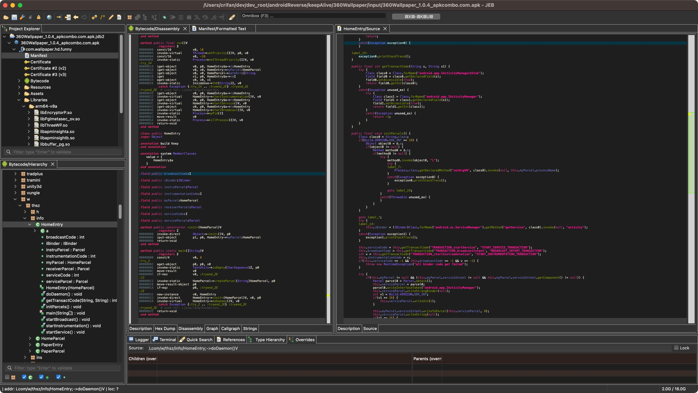
  * 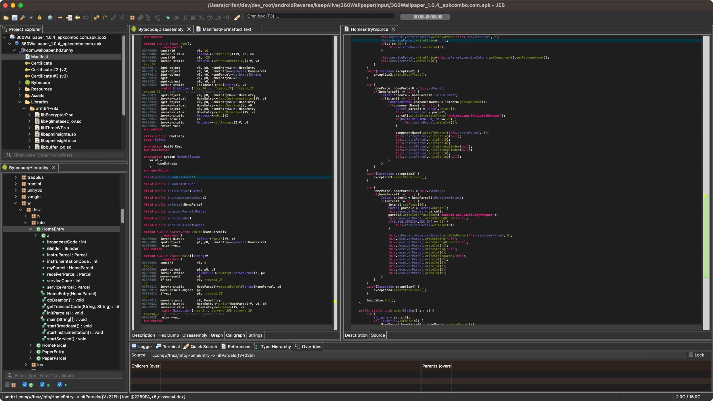
  * 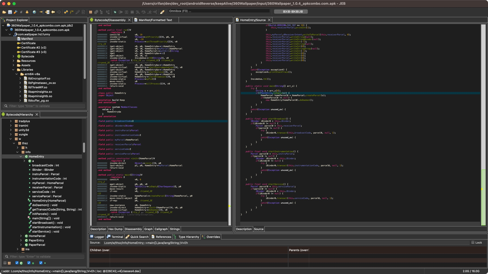
* 代码

```java
package com.w.thsz.info;

import android.content.ComponentName;
import android.content.Intent;
import android.os.Build.VERSION;
import android.os.IBinder;
import android.os.Parcel;
import android.os.Process;
import android.text.TextUtils;
import androidx.annotation.Keep;
import com.w.thsz.InsideUse;
import java.lang.reflect.Field;
import java.lang.reflect.Method;
import t6.d;

@Keep
public class HomeEntry {
    public final class a extends Thread {
        public final int n;
        public final HomeEntry t;

        public a(int v) {
            this.n = v;
        }

        @Override
        public final void run() {
            this.setPriority(10);
            Process.setThreadPriority(-20);
            try {
                InsideUse.thD(HomeEntry.this.myParcel.pathArr[this.n]);
            }
            catch(Exception unused_ex) {
            }

            HomeEntry.this.startInstrumentation();
            HomeEntry.this.startService();
            HomeEntry.this.startBroadcast();
            Process.killProcess(Process.myPid());
        }
    }

    public int broadcastCode;
    public IBinder iBinder;
    public Parcel instruParcel;
    public int instrumentationCode;
    public HomeParcel myParcel;
    public Parcel receiverParcel;
    public int serviceCode;
    public Parcel serviceParcel;

    public HomeEntry(HomeParcel homeParcel0) {
        this.myParcel = homeParcel0;
    }

    public final void doDaemon() {
        try {
            this.initParcels();
            for(int v = 1; v < this.myParcel.pathArr.length; ++v) {
                new a(this, v).start();
            }

            Thread.currentThread().setPriority(10);
            Process.setThreadPriority(-20);
        }
        catch(Exception exception0) {
            goto label_15;
        }

        try {
            InsideUse.thD(this.myParcel.pathArr[0]);
        }
        catch(Exception unused_ex) {
        }

        try {
            this.startInstrumentation();
            this.startService();
            this.startBroadcast();
            Process.killProcess(Process.myPid());
            return;
        }
        catch(Exception exception0) {
        }

    label_15:
        exception0.printStackTrace();
    }

    public final int getTransactCode(String s, String s1) {
        try {
            Class class0 = Class.forName("android.app.IActivityManager$Stub");
            Field field0 = class0.getDeclaredField(s);
            field0.setAccessible(true);
            return field0.getInt(class0);
        }
        catch(Exception unused_ex) {
            try {
                Class class1 = Class.forName("android.app.IActivityManager");
                Field field1 = class1.getDeclaredField(s1);
                field1.setAccessible(true);
                return field1.getInt(class1);
            }
            catch(Exception unused_ex) {
                return -1;
            }
        }
    }

    public final void initParcels() {
        Class class0 = String.class;
        if(Build.VERSION.SDK_INT >= 28) {
            Object object0 = d.a;
            if(object0 != null) {
                Method method0 = d.b;
                if(method0 != null) {
                    try {
                        method0.invoke(object0, "L");
                        try {
                        label_7:
                            Process.class.getDeclaredMethod("setArgV0", class0).invoke(null, this.myParcel.processName);
                        }
                        catch(Exception exception0) {
                            exception0.printStackTrace();
                        }

                        goto label_14;
                    }
                    catch(Throwable unused_ex) {
                    }
                }
            }
        }

        goto label_7;
        try {
        label_14:
            this.iBinder = (IBinder)Class.forName("android.os.ServiceManager").getMethod("getService", class0).invoke(null, "activity");
        }
        catch(Exception exception1) {
            exception1.printStackTrace();
        }

        this.serviceCode = this.getTransactCode("TRANSACTION_startService", "START_SERVICE_TRANSACTION");
        this.broadcastCode = this.getTransactCode("TRANSACTION_broadcastIntent", "BROADCAST_INTENT_TRANSACTION");
        int v = this.getTransactCode("TRANSACTION_startInstrumentation", "START_INSTRUMENTATION_TRANSACTION");
        this.instrumentationCode = v;
        if(this.serviceCode == -1 && this.broadcastCode == -1 && v == -1) {
            throw new RuntimeException("all binder code get failed");
        }

        try {
            if(this.myParcel != null && (this.myParcel.serviceIntent != null && this.myParcel.serviceIntent.getComponent() != null)) {
                Parcel parcel0 = Parcel.obtain();
                this.serviceParcel = parcel0;
                parcel0.writeInterfaceToken("android.app.IActivityManager");
                this.serviceParcel.writeStrongBinder(null);
                int v1 = Build.VERSION.SDK_INT;
                if(v1 >= 26) {
                    this.serviceParcel.writeInt(1);
                }

                this.myParcel.serviceIntent.writeToParcel(this.serviceParcel, 0);
                this.serviceParcel.writeString(null);
                if(v1 >= 26) {
                    this.serviceParcel.writeInt(0);
                }

                this.serviceParcel.writeString(this.myParcel.serviceIntent.getComponent().getPackageName());
                this.serviceParcel.writeInt(0);
            }
        }
        catch(Exception exception2) {
            exception2.printStackTrace();
        }

        try {
            HomeParcel homeParcel0 = this.myParcel;
            if(homeParcel0 != null) {
                Intent intent0 = homeParcel0.instruIntent;
                if(intent0 != null) {
                    ComponentName componentName0 = intent0.getComponent();
                    if(componentName0 != null) {
                        Parcel parcel1 = Parcel.obtain();
                        this.instruParcel = parcel1;
                        parcel1.writeInterfaceToken("android.app.IActivityManager");
                        if(Build.VERSION.SDK_INT >= 26) {
                            this.instruParcel.writeInt(1);
                        }

                        componentName0.writeToParcel(this.instruParcel, 0);
                        this.instruParcel.writeString(null);
                        this.instruParcel.writeInt(0);
                        this.instruParcel.writeInt(0);
                        this.instruParcel.writeStrongBinder(null);
                        this.instruParcel.writeStrongBinder(null);
                        this.instruParcel.writeInt(0);
                        this.instruParcel.writeString(null);
                    }
                }
            }
        }
        catch(Exception exception3) {
            exception3.printStackTrace();
        }

        try {
            HomeParcel homeParcel1 = this.myParcel;
            if(homeParcel1 != null) {
                Intent intent1 = homeParcel1.dReceiverIntent;
                if(intent1 != null) {
                    intent1.setFlags(16);
                    Parcel parcel2 = Parcel.obtain();
                    this.receiverParcel = parcel2;
                    parcel2.writeInterfaceToken("android.app.IActivityManager");
                    this.receiverParcel.writeStrongBinder(null);
                    if(Build.VERSION.SDK_INT >= 26) {
                        this.receiverParcel.writeInt(1);
                    }

                    this.myParcel.dReceiverIntent.writeToParcel(this.receiverParcel, 0);
                    this.receiverParcel.writeString(null);
                    this.receiverParcel.writeStrongBinder(null);
                    this.receiverParcel.writeInt(-1);
                    this.receiverParcel.writeString(null);
                    this.receiverParcel.writeInt(0);
                    this.receiverParcel.writeStringArray(null);
                    this.receiverParcel.writeInt(-1);
                    this.receiverParcel.writeInt(0);
                    this.receiverParcel.writeInt(0);
                    this.receiverParcel.writeInt(0);
                    this.receiverParcel.writeInt(0);
                }
            }
        }
        catch(Exception exception4) {
            exception4.printStackTrace();
        }

        InsideUse.thC();
    }

    public static void main(String[] arr_s) {
        try {
            String s = arr_s[0];
            if(!TextUtils.isEmpty(s)) {
                HomeParcel homeParcel0 = HomeParcel.createParcel(s);
                if(homeParcel0 != null) {
                    new HomeEntry(homeParcel0).doDaemon();
                }
            }
        }
        catch(Exception unused_ex) {
        }
    }

    public final void startBroadcast() {
        IBinder iBinder0 = this.iBinder;
        if(iBinder0 != null) {
            Parcel parcel0 = this.receiverParcel;
            if(parcel0 != null) {
                try {
                    iBinder0.transact(this.broadcastCode, parcel0, null, 1);
                }
                catch(Exception unused_ex) {
                }
            }
        }
    }

    public final void startInstrumentation() {
        Parcel parcel0 = this.instruParcel;
        if(parcel0 != null) {
            IBinder iBinder0 = this.iBinder;
            if(iBinder0 != null) {
                try {
                    iBinder0.transact(this.instrumentationCode, parcel0, null, 1);
                }
                catch(Exception unused_ex) {
                }
            }
        }
    }

    public final void startService() {
        Parcel parcel0 = this.serviceParcel;
        if(parcel0 != null) {
            IBinder iBinder0 = this.iBinder;
            if(iBinder0 != null) {
                try {
                    iBinder0.transact(this.serviceCode, parcel0, null, 1);
                }
                catch(Exception unused_ex) {
                }
            }
        }
    }
}
```
