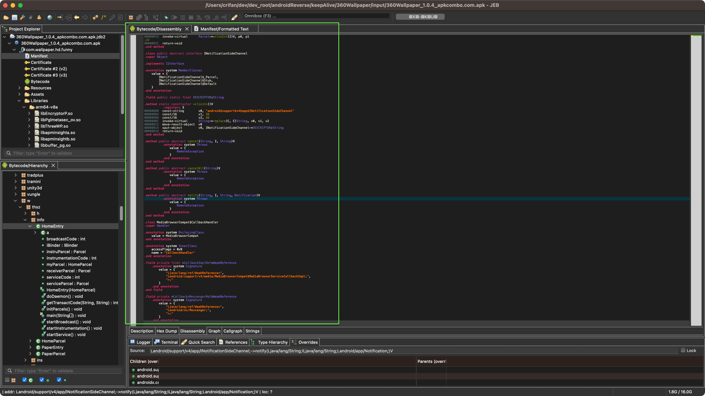
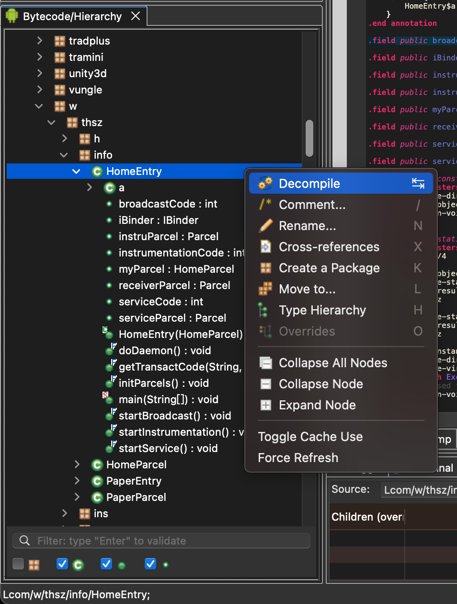
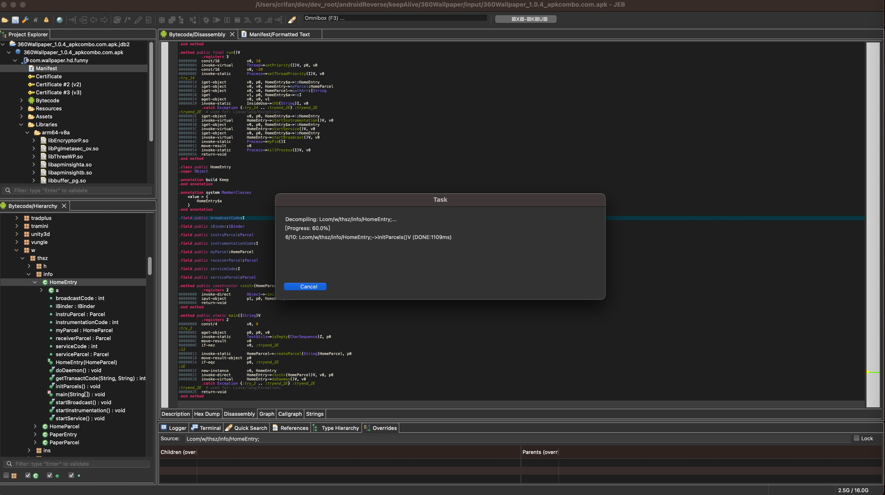
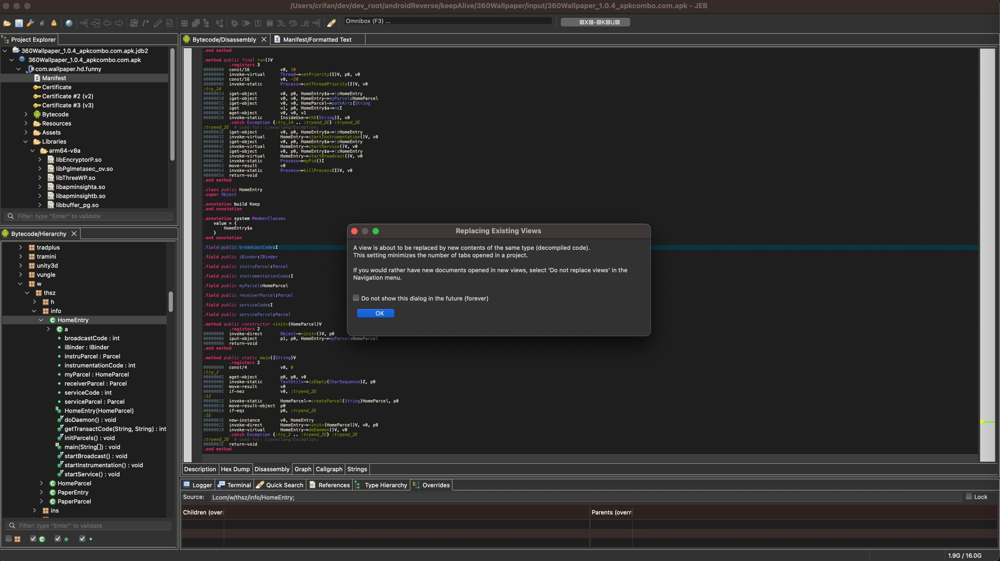
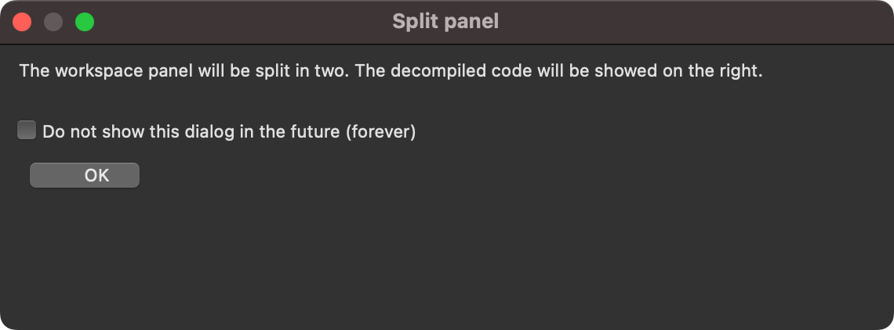
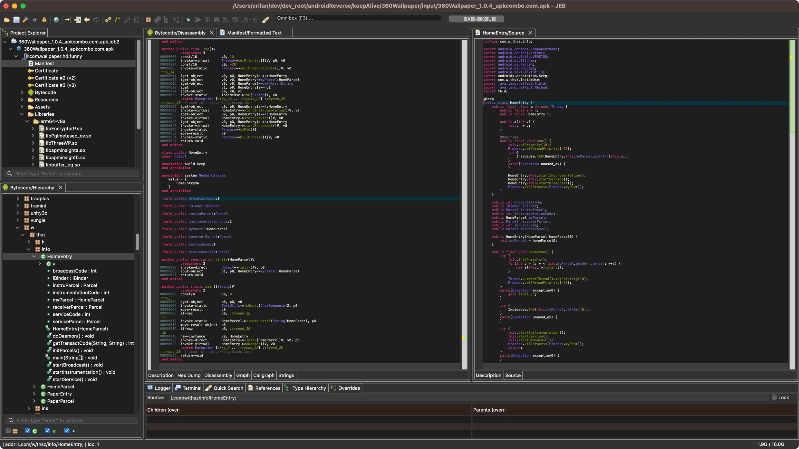

# 单个反编译

* 背景：JEB默认情况下去反编译apk的话，显示的是Bytecode字节码：
  * 
  * 而不是我们要的`Java`代码
* 需求：对于单个类去反编译出java代码

从左下角窗口中，展开找到自己要反编译的java的类->右键->`Decompile`：

会弹框开始反编译：

首次会有（勾选不再提示后，之后就不会再显示）额外的弹框提示，新的反编译的内容要显示在新的视图，但要替代当前视图：

以及还会提示，显示窗口要分左右两个子窗口，右边用于显示刚反编译出来的java源代码：

然后就可以正常显示反编译后的java源代码了：

