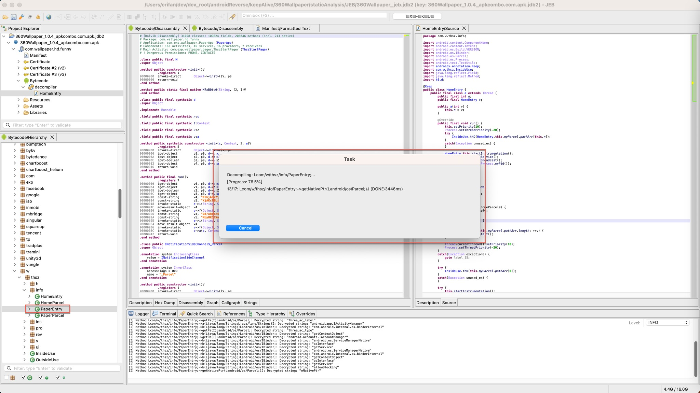
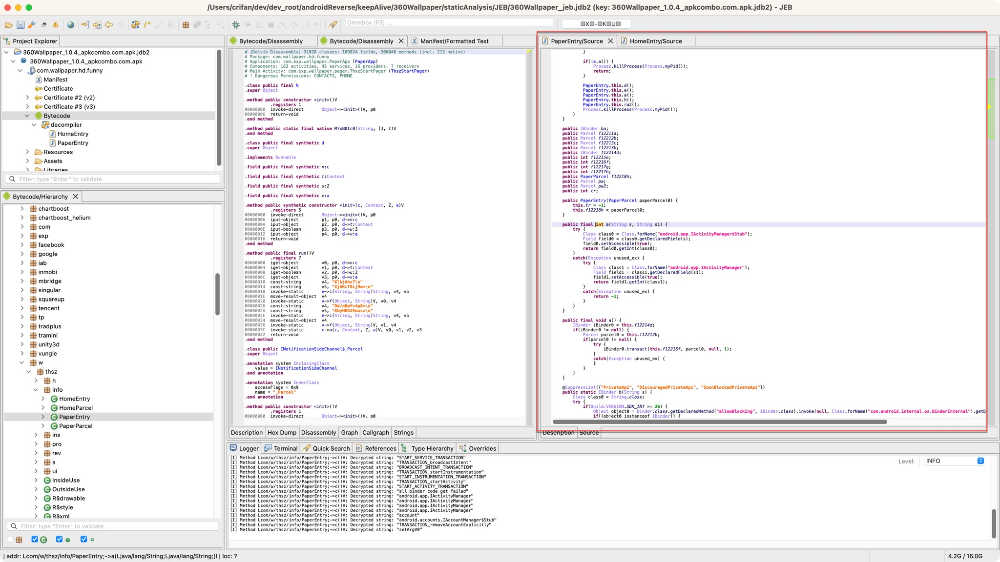
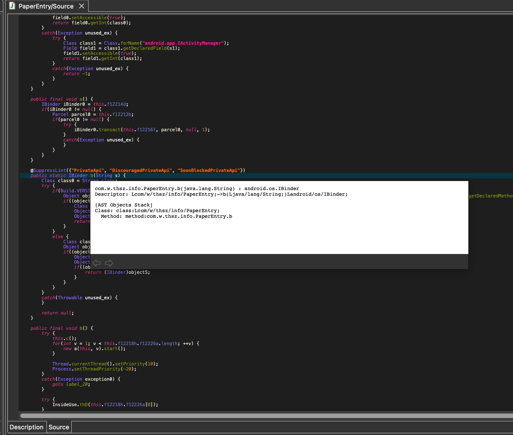
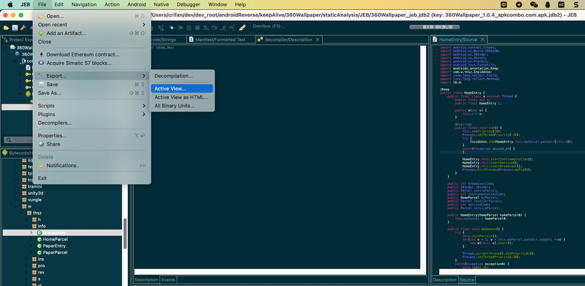
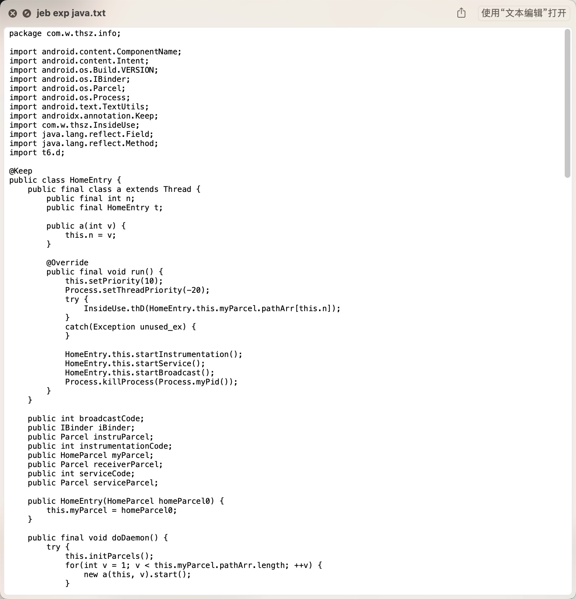
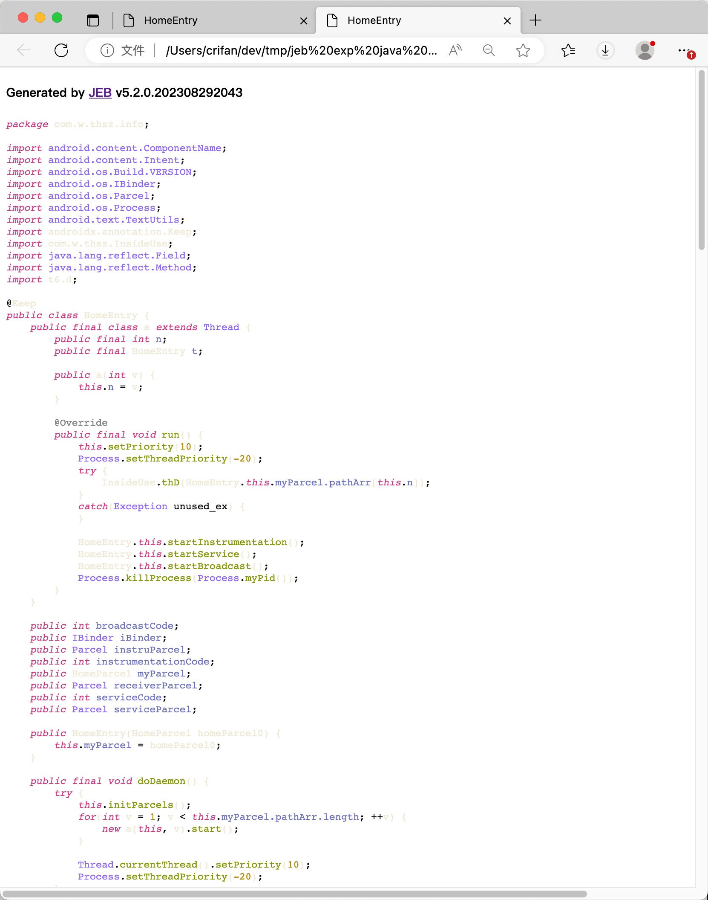
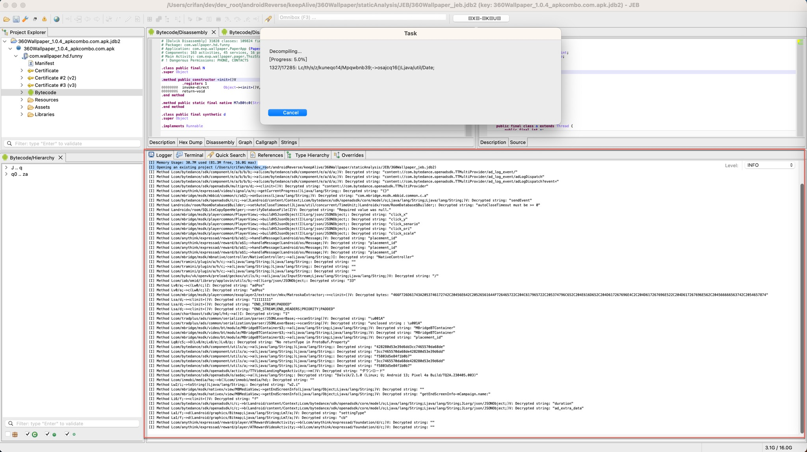
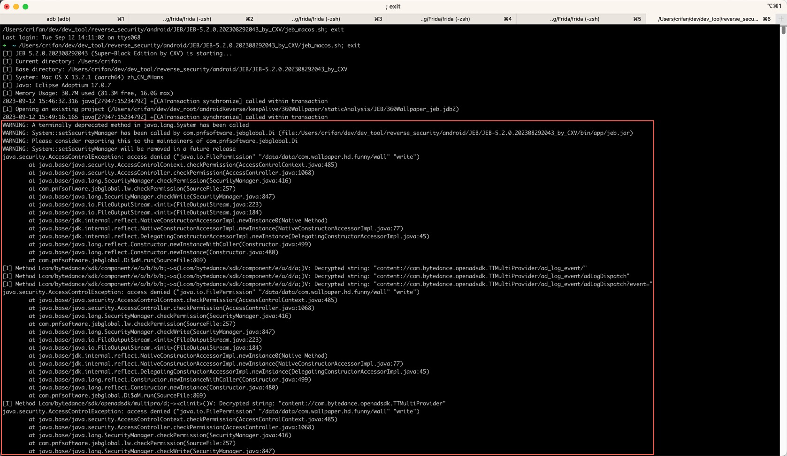
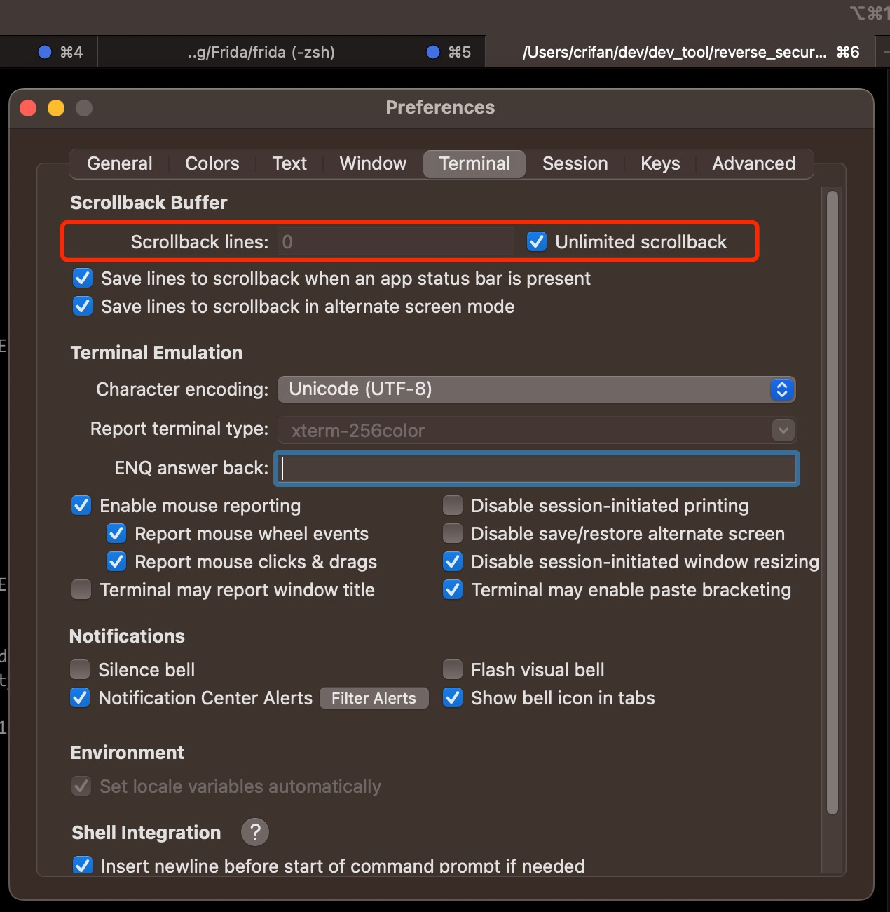

# 反编译java代码心得

## 单个类（文件）的反编译java代码

### 反编译单个类的java代码

#### 双击Bytecode中对应的类可以自动反编译

对于Bytecode窗口中，对于某个类（`com.w.thsz.info.PaperEntry`，双击后，等价于`右键`->`Decompile`

会弹框提示开始反编译：

反编译完成后，此处右上角显示出反编译后的java源码：

### 反编译后的单个类的java代码

#### java代码支持动态提示详情

反编译后的java代码窗口中，鼠标移动到某个内容上，比如类，函数等，此时可以：显示出对应内容的详情

举例：鼠标移动到某函数上，可以显示出函数的详情：

#### 导出当前反编译代码

JEB支持，导出当前视图View的内容：

* 确保当前视图（鼠标所在位置是）反编译代码窗口，然后
  * 导出为普通文本：`JEB`->`File`->`Export`->`Active View`
    * 
    * ->导出效果：普通文本文件
      * 
  * 导出为HTML网页：`JEB`->`File`->`Export`->`Active View as HTML`
    * 
    * -> 导出效果：html网页，用浏览器打开后的效果
      * 

## 全部所有（的类）的反编译java代码

### 查看（导出）所有反编译的log日志

在[批量反编译全部代码](../../jeb_static_analysis/decompile_apk/decompile_to_java/batch_all.md)期间，对于想要查看反编译期间的日志：

是可以通过JEB底部的Logger的tab页，查看到对应日志的：

但是实测发现，最多只能保留2000行左右的日志。更多的日志，会被冲掉，无法保留。

* 想要查看=保留=导出全部反编译的日志
  * 背景=前提：此处Mac中通过iTerm2中运行`jeb_macos.sh`而启动JEB
  * 办法：
    * 发现终端中（和Logger中同步）也会显示反编译期间的log日志
      * 
    * 所以可以去给iTerm2的buffer设置足够大或无限大小
      * 
    * 即可显示=保存出全部反编译期间的所有的log日志
      * 后续去选择并拷贝，即可导出全部日志，供后续分析研究用
